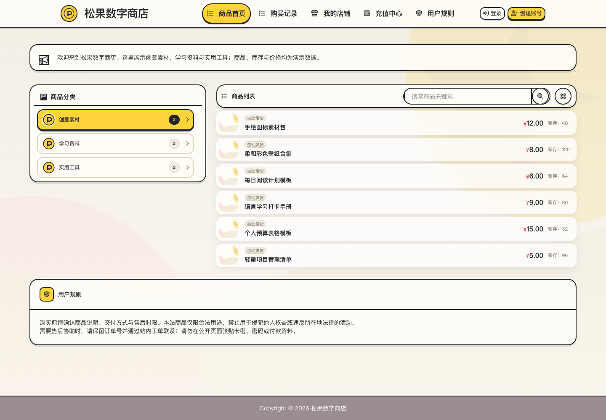

# Acg-Faka Extensions

> 当前 main 源码：PikaSupplySync `1.1.19` 增加[本轮安全诊断](extensions/PikaSupplySync/Wiki/README.md#本轮安全诊断)，展示有界逐项原因与累计请求计时，保留既有库存保护与同步规则。旧 `v0.1.0-preview.1` 固定附件不含此次更新；本批不新建 tag／Release，候选验证与安装回退先看[说明](docs/USER_INSTALL.md)。



真实主题模板、CSS 和 JS 渲染的示例商店，全部商品与价格均为虚构，使用中性素材；不是生产或交易截图。[手机宽度演示](docs/images/pika-theme-117-mobile.png) · [店名与公告外链设置](docs/USER_INSTALL.md#851-店名与公告外部链接)

Acg-Faka Extensions 是面向官方 Acg-Faka 的非官方社区扩展与主题集合。当前首套组件使用 `Pika` 品牌，为官方 Acg-Faka 增加一套独立的开源「本地扩展」运行环境，并提供：

- 货源同步（`PikaSupplySync`）：使用异次元原生共享店铺接口同步多货源商品、价格与库存，新商品默认加价 0%（不加价）。
- 智能货源中心（`PikaCatalogHub`）：从同一后台安全新增或编辑异次元共享货源，默认智能分类，也可在首次入库前显式选择保留上游真实分类层级；确认后在后台分批入库，支持暂停、继续、取消，以及核验通过后的原检查点继续和仅补未入库项。
- 订单支付结果等待（`PikaOrderReturnWait`）：可选的待处理订单返回页体验优化，不处理支付或发货。
- `Pika`：完整的店铺前台与用户中心主题。
- Pika 购买列表／网格和详情不显示销量，库存保留；不改变后台真实销量、统计或排序。
- 商品页余额支付显示当前登录用户在页面加载时的余额；刷新页面后更新。游客不额外展示余额，缺失／异常金额不补成 0。金额不写入浏览器存储，离开或恢复缓存页面时清除新增金额；同页付款、其他标签页充值或切换账号后须刷新，不代表实时余额，不改变支付校验。
- `PikaBEpusdtAdapter`：基于 BEpusdt 公共 API 独立实现的异次元原生支付适配器。

安装完成后，三个扩展会出现在异次元后台左侧的「本地扩展」页面，支付适配器会出现在异次元原生「支付管理」中；它不会出现在异次元应用商店。服务器安装器不会替用户自动启用扩展、支付方式或切换主题。

> 当前 main 源码包含 SupplySync `1.1.19` 的安全诊断及 `1.1.18` 引入的手动商品库存未知保护；Pika 主题保持 `1.1.7`，包含完整店名显示修复与公告外链教程。套装 `0.1.0-dev`、CatalogHub `0.6.9`、OrderReturnWait `1.1.0` 和支付适配器 `0.1.2` 保持不变。本批没有新增 tag／Release：**旧 `v0.1.0-preview.1` 的固定下载附件仍为主题 1.1.6，不包含上述主题、库存保护与 1.1.19 诊断更新。** 既有固定包身份以[预发布页](https://github.com/aiiqc/acg-faka-extensions/releases/tag/v0.1.0-preview.1)为准；不要把 main 或自动生成的 Source code 包当成已验收的新发行包。本批相关验证及未覆盖边界见[项目状态](docs/PROJECT_STATUS.md)。源码、合成截图、固定产物与目标站部署／交易验收分开；第三方二进制媒体再分发权利仍未确认。

公开源码：[aiiqc/acg-faka-extensions](https://github.com/aiiqc/acg-faka-extensions)。私密漏洞报告已启用，入口及脱敏要求见[安全说明](SECURITY.md)；完整证据边界见[项目状态](docs/PROJECT_STATUS.md)。

普通用户请从[安装教程](docs/USER_INSTALL.md)开始，再看[支付配置](docs/USER_INSTALL.md#86-配置-pikabepusdtadapter)、[BE 后台安全访问](docs/USER_INSTALL.md#121-通过本机隧道访问-be-后台)和[支付常见故障](docs/USER_INSTALL.md#122-支付常见故障按层排查)。安装器不配置 Nginx 或链节点；能打开后台、收银台或扫描日志正常，均不等于真实订单已到账。公开默认加价为 `0%`，具体利润由站长自行配置。

## 普通用户从这里开始

- [新手操作路径与真实合成截图](docs/USER_GUIDE.md)
- [完整安装教程](docs/USER_INSTALL.md)
- [常见问题与排查](docs/TROUBLESHOOTING.md)
- [更新记录与升级注意](CHANGELOG.md)
- [当前项目状态、验证证据与待办（唯一状态入口）](docs/PROJECT_STATUS.md)
- [项目总控清单与任务切割](docs/PROJECT_CONTROL_CHECKLIST.md)
- [PikaSupplySync 功能说明](extensions/PikaSupplySync/Wiki/README.md)
- [PikaCatalogHub 货源中心说明](extensions/PikaCatalogHub/Wiki/README.md)
- [贡献说明](CONTRIBUTING.md)
- [安全报告与支持边界](SECURITY.md)

当前开发套装一次安装本地扩展管理器、上述三个扩展、Pika 主题和 `PikaBEpusdtAdapter`。它暂不支持从后台上传 ZIP、填写 URL、执行 Shell、安装 systemd，或单独在线升级任意组件。

## 兼容范围

公开新安装只推荐官方 Acg-Faka `3.7.9`，精确 commit 为 `5120942d2c13ac900d614b09cfd6fbf672b62840`。使用前仍须核对公开固定制品及目标站验收，不能仅凭版本字符串判断兼容。

`3.6.4`、`3.7.0`、`3.7.5` 仅保留为历史兼容契约与回归基线，精确身份见 [compatibility.json](compatibility.json)；不作为公开新安装建议，也不表示旧版的任何通过可外推到新版。历史分类镜像与支付隔离证据的覆盖范围不同，不能承诺所有支付通道或完整异常生命周期均已验证。安装要求如下：

- 非容器、保留 `.git` 的官方 Git checkout；
- PHP CLI 与站点 FPM 8.1 或更高版本，并启用 `curl`、`json`、`mbstring`、`openssl`、`pdo_mysql`、`posix`；
- `3.7.9` 还必须启用 `bcmath`；不把该新增检查无条件施加于上述三个旧兼容版本；
- 每个站点使用独立的非 root PHP-FPM/Web 用户及其独立主组。

安装器遇到版本、commit、关键文件哈希、权限或路径不匹配时会拒绝安装。Docker 目前不在支持范围内：官方镜像启动过程会改变主题文件所有权，尚未完成专用容器生命周期验证。

## 最短安装流程

下面只是流程摘要，不可替代[完整安装教程](docs/USER_INSTALL.md)：

1. 先按[官方初始化与扩展权限切换说明](docs/USER_INSTALL.md#先完成官方首次初始化再切换到扩展权限契约)独立安装上述固定官方 Acg-Faka `3.7.9`，核验数据库及官方安装锁，再完成首次后台登录和本地使用协议确认；不要提前套用扩展安装后的只读配置权限。
2. 在上述预发布页确认固定 tar.gz 与配对 `.sha256` 附件确实存在，再按完整教程获取并核对发布方提供的 SHA256。预览版不等于稳定版或目标站已通过验收。
3. 把 release 解压到 `root:root`、Web 用户不可写的版本目录；目标站点根目录、兼容桥文件及其父目录也必须是 `root:root`。
4. 对外启用 503 维护页，停止该站点的专用 PHP-FPM 与所有 Web/CLI 写入者；若使用共享 FPM master，只清空该站独立 pool 的 worker，禁止停掉承载其他站点的共享服务。
5. 以 root 执行一次安装命令：

```bash
test -n "${PIKA_RELEASE_DIR:-}" || exit 1
sudo "$PIKA_RELEASE_DIR/scripts/install.sh" \
  --site-root /opt/acg-faka \
  --web-user acgfaka-demo \
  --confirm-maintenance \
  --php /usr/bin/php
```

6. 重载或重启专用 PHP-FPM 以清除 OPcache，在仍处于维护状态时运行安装后检查与站点健康检查。
7. 在「本地扩展」保存配置并启动需要的扩展，再把 PC 商城与 PC 会员中心主题都选择为 `Pika`，移动端设为跟随；官方首次登录与本地使用协议确认已在第 1 步完成。
8. 在「智能货源中心」选择协议版本、分类方式并填写上游。分类默认智能；保留上游结构需显式选择协议 `0` 且源站具备配套能力，已有映射不能换模式。协议下拉顺序为 `0` 异次元(V3.1.2 重构后全新版)、`2` 异次元(V3.1.1 之前旧版)、`1` 萌次元(V4.0)，默认 `0`。系统先验证 HTTPS 上游并保存原生共享店铺，再创建分析任务；镜像预览须核对完整父链，不支持时不会降级入库。
9. 以站点 Web 用户执行 SupplySync `basic --dry-run`，通过后安装 SupplySync 与 CatalogHub worker 两组 systemd service/timer；返回智能货源中心确认分类映射和加价比例，后台任务才开始分批入库。

## 明确边界

- 本仓库不包含、替换、分析或模拟异次元专有应用商店组件。
- 兼容门只保护五个 MIT 文件：`kernel/Kernel.php`、`kernel/Helper.php`、`app/Controller/Admin/Api/Config.php`、`app/View/Admin/Footer.html`、`assets/common/js/editor/markdown/editorv2.js`。3.6.4 bridge 修改五个文件；3.7.0、3.7.5 与本批 3.7.9 bridge 只修改前三个，另外两个仍进入安装回执与恢复校验。3.7.9 只移植既有扩展钩子，保留官方 Owner 权限、公告净化、可信代理 HTTPS 判定及金额修复；不能为恢复旧公告脚本效果撤销安全处理。
- 核心升级必须在旧回执仍有效时先完成配对 restore，再换完整固定官方 checkout、独立执行并核验必要数据库迁移、安装新扩展及显式接续兼容状态。安装器不覆盖既有安装、不自动恢复归档状态，也不能用旧 receipt 覆盖新 receipt。后台云 ZIP 增量链不等同固定 Git tag，不是本安装器支持的核心升级方式；完整顺序见[核心升级边界](docs/USER_INSTALL.md#133-升级到固定官方-379-的边界)。
- 本地扩展与官方应用商店插件相互独立，可以同时使用。
- PikaCatalogHub 的「测试并接入」使用独立安全连接入口：只接受 HTTPS 标准 443 根地址和公共 DNS，验证证书、固定目标 IP、禁止重定向与代理，再把成功结果写入异次元原生 `shared` 表，因此不需要到「店铺共享」重复填写。
- 新货源的唯一推荐入口是「智能货源中心」。异次元原生「接入货源」会绕过智能分类、确认方案与后台暂停／继续／取消，直接由浏览器批量入库；原生页面只保留给底层记录查看及完成备份和引用盘点后的高级维护。
- 商户密钥只存在于本次请求内存和异次元原生 `shared.app_key`；不会进入 Pika 配置、任务、快照、响应或日志。页面在请求结束时清空输入框，但浏览器内存是否被操作系统立即回收不作保证。
- 如果官方货源保存成功、Pika 分析任务创建失败，官方货源仍会保留；刷新后对该货源点击「智能分析」即可重试，不要重复新增。
- PikaSupplySync 只管理自己新导入、带 `PKS1` 编号的商品，不接管已有商品。
- PikaCatalogHub 分析阶段只读；管理员确认完整映射后，后台 worker 才创建插件管理的分类并导入新商品。暂停或取消不会强杀当前数据库交易，也不会删除已导入的数据。
- `source_id` 始终是货源的不变内部身份。smart 保留显示名称与插件受管货源层分类的联动；mirror 没有额外别名层，后台改名不改真实上游树。例如上游 `Telegram → 货源A → 子分类` 原样保留，不再插入本地显示名。镜像不持续同步分类改名、移动、删除或排序；新建采用冻结排序，复用保留本站排序。
- 完全一致的同值保存仍不访问上游；若历史显示名与受管分类不一致，同值保存须先修复一致性，不能假报零副作用。存在活动或可恢复失败任务时先完成或取消任务再改名。外币零汇率等原安全限制不变。
- smart 分类管理使用同页的货源联动改名入口；不要手改受管货源节点。mirror 的已有名称／父级漂移会阻断后续导入，不自动迁移。旧代码不能读取镜像元数据，回退须配对恢复配置、任务、映射；若已入库，还涉及业务数据，不能只换代码。隔离安装恢复不等于目标站点验收。
- 取消不等于回滚。需要撤销已导入商品时，应先停用任务和 timer，再通过异次元后台按明确范围处理；插件不会自动删除业务数据。
- 周期库存规则与原生单品库存开关均允许时，缺货同步只把受管理商品库存写为 0，不改变管理员设置的上下架状态。Pika 主题隐藏库存 0 的商品；补货后成功写回正库存才恢复显示，关闭库存同步则保留本地库存。
- 新商品首次导入会按上游初始化秒杀、起购、限购和联系方式；之后的周期同步不再覆盖这些站长运营字段。
- SupplySync 的 `basic` 模式只更新已经由 Pika 管理的商品，不会自动发现上游以后新增的商品；需要回到「智能货源中心」重新执行「智能分析」，确认新增映射后再入库。
- CatalogHub worker 会在上一轮结束约 1 分钟后再次唤醒、每轮最多处理 20 项；没有任务时会快速退出。上游较慢时两次启动的间隔会相应变长。暂停、继续和取消都在当前单项处理完成后的安全边界生效。
- HTTPS 请求最多尝试 3 次（包含首次）；只有可重试的网络传输失败和 HTTP `408/429/502/503/504` 会自动重试，基础退避为 500／1000 毫秒。合法的 `Retry-After` 仅在剩余预算容得下等待和下一次尝试时采用；预算不足就停止，不保证一定发满 3 次。连接 5 秒、单次请求 90 秒、单货源 120 秒、整轮 300 秒及 systemd 外层 8 分钟上限不变。
- 详情失败按安全类别显示。传输/可重试 HTTP 错误满足检查点条件时，可由用户核对原因后点击「继续入库」；历史旧码 `ITEM_DETAIL_FETCH_FAILED` 只表示原因未分类，保留人工继续入口不等于已证实瞬时故障或上游恢复。本批新产生的未知失败 `ITEM_DETAIL_UNKNOWN_FAILED` 不提供继续入口。业务、凭据、响应格式、预算及其他不可恢复错误先处理原因，任务不自动续跑；不能通过反复点击跳过坏数据。详见[失败分类与恢复](docs/TROUBLESHOOTING.md#详情读取失败怎样处理)。
- 页面只读进度轮询遇到明确的 CSRF 校验失败时，只有旧令牌签名仍能按当前登录会话验证，才可最多续期并重读一次；换会话或无效签名拒绝续期。普通轮询暂时失败保留最后已知进度，连续 3 次失败停止自动轮询并提示刷新。保存、确认、暂停、继续、取消等写动作不自动重放；页面读取失败不等于后台任务失败。
- 后台最多保留 64 条任务记录；创建新任务且达到上限时，只会自动退役可回收的 `completed`、`cancelled` 或不可恢复 `failed` 记录。活动任务及可继续的详情失败任务不会被淘汰；容量不足时先完成或明确取消任务。对应快照由持久清理回执精确收口。
- 隔离试装前必须记录目标文件系统的 `df -B1` 与站点、站外状态、图片缓存的 `du -sb`。CatalogHub 单个快照上限为 16 MiB、最多 64 条任务，理论快照上限是 1,073,741,824 字节；还必须另加完整灾备与图片缓存增长余量。空间不足时保持 503 并停止，不会自动清理任务、快照、备份或图片。
- `PikaBEpusdtAdapter` 是本仓库的开源原生支付适配器，不依赖异次元应用商店授权。它根据 BEpusdt 公共 API 独立实现，本仓库不复制或分发 BEpusdt 的 GPL 源码。
- 支付适配器只负责异次元与站长自有 BEpusdt 后端之间的通信。站长仍须自行部署并配置 BEpusdt、钱包、RPC、公开结账入口和匹配的 API Token；Token 与站点命名空间由 root-only 配置命令写到站点外，不存入异次元数据库。
- 安装器不会修改数据库、Nginx、PHP-FPM、systemd、支付配置或 BEpusdt 后端；真实支付、充值和商品订单必须由站长自行测试。

Pika 主题包含基于 Acg-Faka 内置 Cartoon 主题修改的模板；上游版权和 MIT 条款见 [THIRD_PARTY_NOTICES.md](THIRD_PARTY_NOTICES.md)。本项目代码采用 [MIT License](LICENSE)，不覆盖未知权利的第三方二进制媒体。本次预发布按维护者选择保留原素材与出处，独立再分发权利仍为 UNKNOWN；这不是第三方授权，免费、署名或侵权移除说明都不能代替许可。素材说明中的独立许可提醒仍适用；下游使用或再分发前须自行确认权利。
