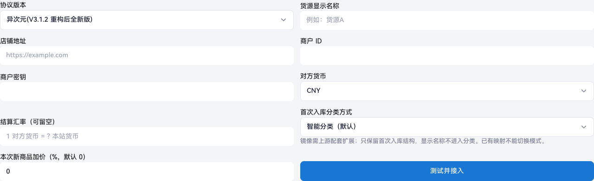
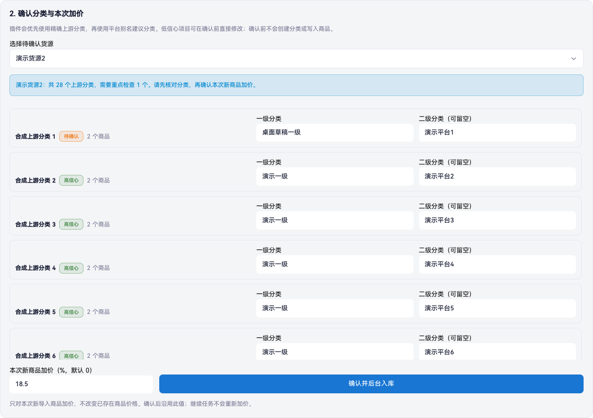
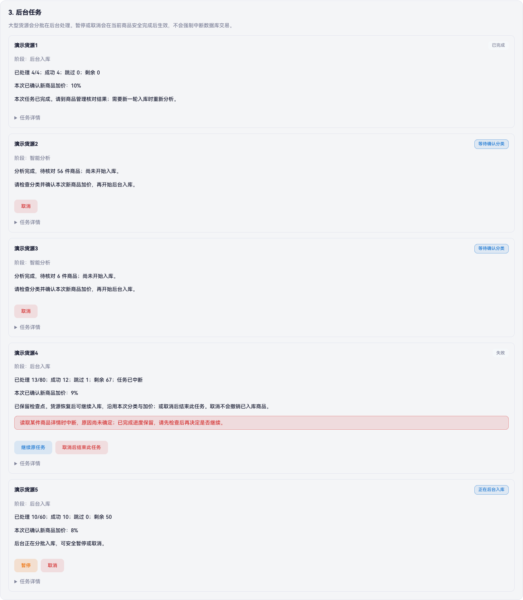
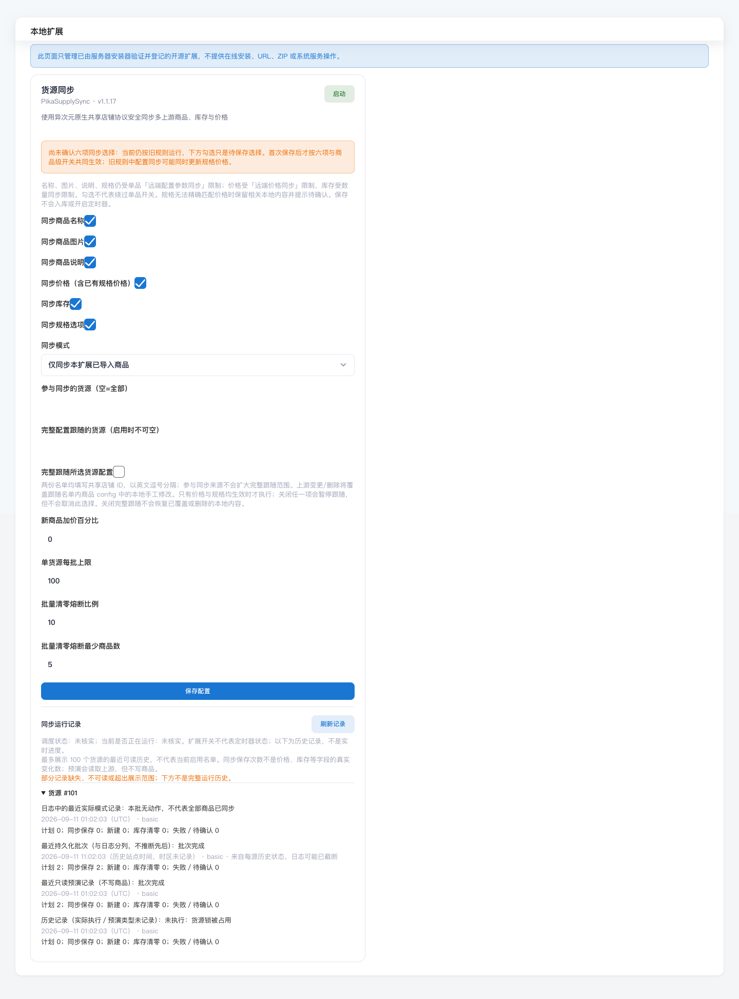

# 从安装到日常使用

对应 Hub 0.6.9／SupplySync 1.1.17；这是 `v0.1.0-preview.1` 预览版导览，不是生产验收凭证。固定下载身份以[预发布页](https://github.com/aiiqc/acg-faka-extensions/releases/tag/v0.1.0-preview.1)实际附件为准；缺失时停止，不能把提交前说明当作已完成发布。先按顺序看懂流程，实际安装与服务器命令请用[安装教程](USER_INSTALL.md)。截图由当前页面代码配合合成数据生成，不包含实际商户、客户、密钥或支付地址。

## 1. 先装官方商城，再装扩展与主题

先完成固定官方 Acg-Faka 3.7.9 的安装、数据库核验、首次后台登录及使用协议确认；不能在官方初始化前就把所有配置收成 Web 只读。随后核对扩展制品身份、备份、进入维护、停本站写入者、运行 doctor，再安装整套扩展。安装完成不等于启用：在「本地扩展」保存配置并启动所需组件；PC 商城与 PC 会员中心均选 Pika，移动端设为跟随。

安装器不替你配置 Nginx、支付后端或定时器，也不自动启用支付。源码在[公开仓库](https://github.com/aiiqc/acg-faka-extensions)；只有实际发布的固定附件及 SHA256 才能用于教程中的下载核验。详见[初始化与权限](USER_INSTALL.md#先完成官方首次初始化再切换到扩展权限契约)、[安装后验收](USER_INSTALL.md#7-仍在维护状态下验收安装)及[主题切换](USER_INSTALL.md#85-切换-pika-主题)。

## 2. 直接在智能货源中心接入

打开「本地扩展 → 智能货源中心」，选择协议、首次分类方式，填写自己获授权使用的货源资料，再点「测试并接入」。无需去原生「店铺共享」重复录入；原生批量入库不是这条确认流程的替代入口。

| 下拉值与显示名称 | 含义 |
|---|---|
| 0：异次元（V3.1.2 重构后全新版，默认） | 新版异次元共享协议；镜像分类只支持这一类 |
| 2：异次元（V3.1.1 之前旧版） | 旧版异次元共享协议 |
| 1：萌次元（V4.0） | 萌次元共享协议 |

这些是货源协议标签，不是本站商城版本；本站运行 3.7.9，不意味着下拉中应该出现“3.7.9”。店铺地址需为 HTTPS 标准 443 根地址，域名解析得到的地址必须全部为公共地址；私网或保留地址会被拒绝。密钥不回显，不放截图或日志。接入成功但分析创建失败时，先刷新已有货源，再点该记录的「智能分析」，不要重复新增。详见[接入要求](USER_INSTALL.md#81-在智能货源中心一键接入上游)。

当前接入表单：协议、首次分类方式、币种／汇率与默认 0% 加价。地址只是示例占位，商户 ID 和密钥为空；未连接真实货源。图中显示默认智能分类，不代表镜像分类流程已验收。

## 3. 先选分类方式，分清两种图片

默认「智能分类」（smart）会创建平台／可选系列／货源层／上游分类。首次入库前也可明确选「镜像分类」（mirror），按来源及上游分类 ID 保留真实层级，不额外插入后台显示名。mirror 要求源端具备对应能力；不支持时停止，不自动改为 smart。已有映射不能切换模式。

smart 的货源别名会联动受管货源层分类，分类 ID 和商品引用不变；mirror 改名只影响后台显示名，不改变真实树。两种模式都不要通过手工改受管节点绕过规则。镜像不是长期分类同步，不会持续跟随上游改名、移动、删除或排序。

商品封面出现在商品卡片，后续受六字段中的「图片」控制；分类图标出现在分类入口，是另一条能力。支持图标能力时，仅新建镜像节点初始化分类图，已有节点保留本站图标。旧分类补图需要独立受信维护入口及精确范围，不靠重新入库、重跑 basic 或勾选商品图片解决。详见[分类图说明](../extensions/PikaCatalogHub/Wiki/README.md#分类图与受信维护入口)。

## 4. 核对分类与加价后，才确认后台入库

分析不会创建商品或分类。待方案出现后，核对完整分类路径、数量、货币／汇率及本次加价，再确认；默认加价 0%，不是预设利润。确认后方案固定，后台处理程序才会分批入库，每轮最多 20 项。新手顺序是：接入并创建分析 → 保存 basic 配置 → 按教程完成首次试运行（dry-run）及同步、入库两组定时任务（timer）安装 → 等待分析 → 确认方案 → 查看后台入库进度。

首次入库按确认比例保存商品规则，之后周期价格按该规则重新计算，不是在上一轮售价上再叠加一次。修改“新商品加价百分比”不会自动重写既有商品规则；0% 也要核对币种、汇率与既有精度换算。已有商品的批次上限默认 100，与入库 worker 的 20 是两个不同上限。

图中分类、数量及 18.5% 都是合成演示数据，不是推荐利润；长分类列表可滚动，确认前应核对全部条目。本轮夹具只验证服务端拒绝确认后不会自动重放，不代表商品已真实写入。

暂停、继续和取消在当前单项处理完成后的安全边界生效，不强行中断正在处理的商品。取消不可恢复，但不会删除已入库商品，因此取消不是回滚。失败时只有后台核验通过才提供原检查点继续或「只重试未入库项」；前者接续未处理部分，后者只处理可信异常清单，不重做成功项。不要手改任务文件、倒退进度或删除商品来绕过限制。

图中成功、等待、失败和运行进度均为合成状态。失败卡片是可恢复旧错误码的演示，不表示新发生的未知错误都能继续；实际按钮取决于后台核验。本轮只实际点击了一次合成失败任务的取消，未验证完整暂停／继续过程、仅补失败项或真实入库。上述三图使用当前 Hub 0.6.9 模板与 JS，但不是完整官方后台启动链。操作以[当前 Wiki](../extensions/PikaCatalogHub/Wiki/README.md)和[入库步骤](USER_INSTALL.md#83-确认智能分类并后台入库)为准。

## 5. 六字段控制后续更新，运行记录不是实时调度监控

货源同步提供名称、图片、说明、价格、库存、规格六项。第一次完整保存后，未选项保留本地，全不选则不请求上游、不写商品；仍与原生单品同步开关取交集。旧配置页面全勾只是“待保存选择”，不是已采用新规则。首次完整入库不受这六项替代。

“完整商品配置跟随上游”默认关闭，启用时必须填写独立货源名单，且价格与规格双有效；它会覆盖该范围内 config 的本地增改删。六项全勾或扩大“参与同步”名单都不自动授权完整跟随，关闭也不会恢复已覆盖内容。默认 basic 只更新已有受管商品；上游新增商品需回到智能分析并确认，不为发现新品改用 full。已有 Hub 映射或活动任务的来源会在 full 连接前被拒绝。

上图由当前候选的真实管理器模板、JS、manifest，以及固定官方静态资源实际运行生成；记录、来源 ID 和响应全部合成，图中旧配置与历史时间只是示例，不是推荐配置或真实执行记录。[手机宽度图](images/supply-sync-117-history-mobile.png)使用同一夹具；它不是手机实机验收。夹具 URL 的版本测试参数仍为 3.7.0，不等于完整 3.7.9 后台运行。

「刷新记录」只读，不触发同步，也不核实 timer 或当前进程。timer active 仅表示调度启用；oneshot service 的 inactive 可能正常，要联合检查同轮退出码、阶段、来源结果与日志。`OnActiveSec` 和 `OnUnitInactiveSec` 任一到期均可触发，不把两个等待相加。Supply 默认约 10 分钟间隔，worker 默认约 1 分钟；实际上一次／下一次时间以已加载 unit 为准。

成功动作数不是独立商品数或实际字段变化数，`applied.zero` 也可能只是重复保存零库存。`partial` 可能已有提交，不是全轮成功或零写入；本轮目录失败时，保存的 state 可能仍属于上一轮。1.1.17 新诊断按目录／详情／图片保留有界摘要，不是完整商品追踪；预算只是最近既有检查采样，没有值就不猜成 0。

## 6. 失败先分类，不靠反复点击判断

网络传输及 HTTP 408／429／502／503／504 可在原预算内最多尝试 3 次（含首次），不保证发满。HTTP522 不在自动重试白名单，但这不证明故障永久存在；同样不能据一个状态码证明瞬时原因或上游已经恢复。

凭据、业务、结构、安全策略、预算或数据库错误需要先处理原因；无法恢复的任务不能反复继续。页面进度读取失败也不等于后台任务失败。安装／配置／程序／业务不变量异常要停止；外部请求失败及 partial 按已有进度和有界观察计划判断，不因 HTTP 码变化机械卸装。详见[失败分类](TROUBLESHOOTING.md#详情读取失败怎样处理)。

## 7. 支付独立配置、独立验收

BEpusdt 后端由站长另行部署；适配器仅提供接口连接，支持 `usdt.bep20`、`tron.trx`、`usdt.trc20`，没有配置和验收的链保持关闭。商城仅保存 gateway_origin、checkout_origin、merchant_origin、fiat 四个非秘密字段；Token 与站点命名空间在站外。API 走本机回环，checkout、merchant 及原生 callback_domain 必须使用相同规范 HTTPS origin。

订单支付结果等待只改善远程支付返回后的待付款查询页：默认最长 15 秒、间隔 2 秒，最多自动刷新 15 次，不处理支付／发货；余额支付与零元订单不触发。不要把等待页、付款选项、后台能打开或 RPC 扫描日志当作到账。

先按[支付配置](USER_INSTALL.md#86-配置-pikabepusdtadapter)及[支付排障](USER_INSTALL.md#122-支付常见故障按层排查)完成检查；真实付款／充值／购买需要另行明确账号、钱包和金额上限。升级后旧支付成功不能替代本次交易验收。

## 8. 升级和恢复不要只换文件

核心升级先在旧回执有效时配对 restore，再换完整固定官方 checkout、核对必要迁移、安装新扩展并显式接续状态。恢复工具恢复受管文件，不恢复数据库、已付款业务或已导入商品；必须保全日志与最新状态，先处理在途交易。已经产生新业务／任务状态时不能仅切旧代码或覆盖旧 jobs。详见[文件恢复](USER_INSTALL.md#132-恢复安装前文件)及[固定核心升级](USER_INSTALL.md#133-升级到固定官方-379-的边界)。

## 截图覆盖与缺项

| 主要功能 | 当前可公开展示的覆盖 |
|---|---|
| 智能货源接入、分类与加价、任务控件 | 当前 0.6.9 三张合成桌面图；mirror、分类图、完整暂停／继续、仅补失败项和真实入库仍缺项。旧 0.6.0 [桌面](images/catalog-hub-060-desktop.png)／[手机](images/catalog-hub-060-mobile.png)图原样保留，仅作历史布局参考 |
| 六字段、完整跟随警告、同步历史 | 本次实际运行生成的桌面／手机宽度合成截图；不代表已启用调度或真实上游运行 |
| 官方安装、本地扩展／主题启用 | 已有文字步骤，安全截图缺项 |
| Pika 前台、会员页、订单等待 | 安全公开截图缺项；不使用生产截图。主题展示还涉及媒体权利 |
| 支付后台配置、收银页、到账 | 安全截图缺项；不放真实地址、二维码或交易凭据，不以合成付款选项冒充到账 |

缺图不表示功能不存在，也不表示已经验收。本轮不另造演示平台。代码 MIT 不覆盖未知权利的媒体；动态壁纸出处及再分发边界见[第三方声明](../THIRD_PARTY_NOTICES.md)。
