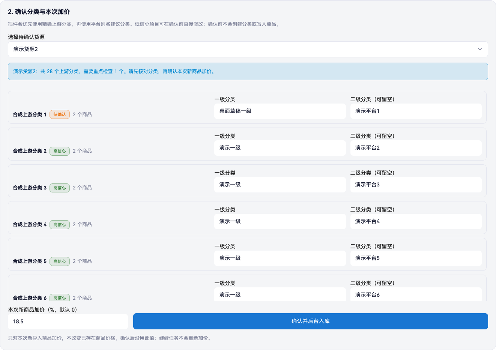

# Acg-Faka Extensions V0.1 用户安装教程

本教程面向已经会部署基础 PHP 网站、可以使用 root 或 sudo 的 Acg-Faka 站长。Acg-Faka Extensions 当前提供 Pika 开发套装：在一套干净的官方异次元上，通过一条服务器安装命令加入「本地扩展」后台、三个固定扩展、Pika 主题和 `PikaBEpusdtAdapter` 原生支付适配器。

当前 main 源码含 SupplySync `1.1.18`，套装仍为 `0.1.0-dev`，不是稳定版。本批不新增 tag／Release，旧 `v0.1.0-preview.1` 固定附件不含本次修复。公开源码为 [aiiqc/acg-faka-extensions](https://github.com/aiiqc/acg-faka-extensions)；已有下载附件及 SHA256 以[预发布页](https://github.com/aiiqc/acg-faka-extensions/releases/tag/v0.1.0-preview.1)实际内容为准，不把 main 自动源码包当成已验证新发行包。第 3 节缺少已核参数时会停止；源码或预览版不是生产许可。媒体权利与安全边界继续见[项目状态](PROJECT_STATUS.md)和[安全说明](../SECURITY.md)。

当前源码对应 PikaCatalogHub `0.6.9`／PikaSupplySync `1.1.18`、主题 `1.1.7`、支付适配器 `0.1.2`。原生 basic 手动空库存保护及状态回退限制见[货源同步说明](../extensions/PikaSupplySync/Wiki/README.md#手动商品库存未知保护)。最终制品、目标站部署和真实交易仍须分别验收，不能沿用旧版或其他站点结论。BEpusdt 后端单独部署，不包含在扩展安装器内。本文路径、账号和站点命名均为通用示例，不包含实际凭据。第一次使用先读[新手操作路径](USER_GUIDE.md)，再按本教程执行安装、预检和恢复。

## 1. 安装前先确认边界

### 支持的目标站点

- Linux 非容器部署；
- 官方仓库 `https://github.com/lizhipay/acg-faka.git`；
- 公开新安装只推荐 Acg-Faka `3.7.9 / 5120942d2c13ac900d614b09cfd6fbf672b62840`；仅在最终固定制品及目标站通过对应验收后使用，不把版本字符串相同的后台 ZIP 更新结果视为同一官方基线；
- `3.6.4`、`3.7.0`、`3.7.5` 只保留为历史兼容与回归基线，精确身份见 [compatibility.json](../compatibility.json)，不作为新安装建议；历史支付和分类镜像隔离的覆盖范围不同，不能互相外推；
- 站点目录必须保留官方 `.git`，不能使用只有源码文件的 ZIP；
- PHP CLI 与站点 FPM 8.1 或更高版本，并启用 `curl`、`json`、`mbstring`、`openssl`、`pdo_mysql`、`posix`；
- 仅 `3.7.9` 额外要求 CLI 与实际 FPM 均启用 `bcmath`，旧三个兼容版本的必需扩展门不变；
- Git、GNU coreutils、`runuser`；安装定时器时还需要 systemd。

目标站点的 Nginx 必须只把入口 `index.php` 交给 PHP-FPM，并拒绝直接访问 `.git`、`config`、`kernel`、`runtime`、`vendor`、`local-extensions` 及其他 PHP 文件。不要使用把 DocumentRoot 内任意 `*.php` 都交给 FPM 的宽泛规则。

Pika 的公开 CSS、JavaScript、SVG、Logo 与背景媒体仍位于官方主题目录。封锁 `/app` 时必须在通用拒绝规则之前精确放行这个静态目录中的必要静态类型；不要使用会抢先匹配全部请求的 `location ^~ /app`：

```nginx
location ~ \.php(?:/|$) {
    return 404;
}

location ~* ^/app/View/User/Theme/Pika/Assets/.+\.(?:css|js|svg|png|jpe?g|mp4)$ {
    try_files $uri =404;
    access_log off;
    expires 7d;
    add_header X-Content-Type-Options "nosniff" always;
}

location ~* ^/(?:app|config|kernel|runtime|vendor|local-extensions)(?:/|$) {
    return 404;
}
```

这条例外不会放行 PHP、README 或整个 `app` 目录。若站点还有其他主题，应按该主题实际引用的公开静态类型逐项扩展，不要直接开放源码目录。`topfans-bg.mp4` 是静音循环的装饰背景，浏览器禁用自动播放、启用节省流量或偏好减少动态效果时会退回静态封面，不影响购买功能。

### 先完成官方首次初始化，再切换到扩展权限契约

下面的运行权限表用于 Pika 扩展安装完成后，不能提前套用到尚未初始化的官方站点。已有正常运行的站点不要重复提交官方安装。

1. **官方初始化权限**：通过受控入口按 `/install/rewrite` → `/install/step` → `/install/submit` 完成官方安装。实际处理请求的本站专用 FPM 身份需要写入 `runtime` 下的模板缓存、编译目录及临时目录；`kernel/Install` 需要临时允许创建和清理 `Install.sql.tmp`、`Install.sql.tmp.process`，并创建 `Lock`。`config` 需要允许后续创建 `terms`。这些是精确初始化目录的临时权限，不是全站递归授权；所有配置和目录都不得手工放宽为 group/world 可写或 `0777`。
2. **已有配置文件也必须可写**：`config/database.php` 在提交安装时必须能被同一 FPM 身份读取和写入。官方 `setConfig()` 使用 `file_put_contents(..., LOCK_EX)` 原位覆盖已有文件，不会先删除或通过改名替换；因此仅让 `config` 父目录可写，不能让 Web 用户写入已有的 `root:root 0644` 文件。首次安装只读取 `config/app.php`，不需要开放它的写权限。
3. **核验安装，再首次登录及确认协议**：确认目标数据库的预期表与管理员已真实创建、`config/database.php` 已绑定该数据库，且 `kernel/Install/Lock` 由官方生成。3.7.0、3.7.5 与 3.7.9 新装还须分别确认数据库配置键 `request_log_key`、`csp_nonce_secret` 存在，且各自严格 Base64 解码后为 32 字节；只输出存在性、格式及长度检查的布尔结果，绝不输出密钥值或数据库密码。官方会吞掉这两个键的初始化异常，不能凭“安装完成”跳过核验；3.6.4 首装不无条件套用这两项要求。然后通过官方后台首次登录并正常同意本地使用协议，让官方创建 `config/terms`；此阶段还须允许官方更新已有 `Lock`，并保持运行缓存可写。HTTP 成功或数据库已有表都不能单独证明安装完成；若失败，先保留现场核对数据库、配置及锁，不重复提交安装，也不用空文件伪造标记。
4. **维护切换与扩展安装**：上述流程完成并验证后台及数据库正常后，再按本教程准备快照、进入外部 503 维护并停止本站写入者。在维护状态下按下文准备 root 管理的不可变路径，收回 `config/database.php` 的临时 Web 写权限；含数据库秘密的配置使用 `root:<本站专用站点组> 0640`，仍需让 FPM 可读，不能改成 world-readable。`config`、`kernel/Install` 父目录与精确可变文件由扩展安装器按下表及后文契约规范化；不要手工递归收权，也不要把 `runtime`、`config/terms` 或 `Lock` 一并改成 Web 只读。扩展安装及检查通过后，才配置扩展开关和主题。

以上初始化顺序来自固定官方版本的安装控制器及配置写入实现；不是放宽扩展安装后的权限检查，也不授权后台在线更新核心。

### 扩展安装准备与安装后的运行权限

目标站点根目录、五个兼容桥文件及其所有父目录必须是 `root:root`，且 group/world 不可写；不能使用常见的 `root:站点组` 作为这些不可变路径的所有权，即使该组只有读取权限也会被安装后完整性门拒绝。普通源码文件可用 `0644`、目录可用 `0755`。只有确实包含秘密的站点配置可以使用 `root:<专用站点组> 0640`；Web 用户只应拥有官方运行目录、Pika 外部状态和公开图片缓存。不要为了满足这条规则把数据库配置改成 world-readable。

Acg-Faka 不是完全只读源码应用：远端图片、模板缓存、应用商店下载、插件安装和部分后台配置会直接写项目目录。安装器因此建立下面这组精确的 compatibility-first 运行契约。安装期间会先确认本站专用 Web UID 没有任何进程，再把 7 个浅层根以 device/inode 绑定暂时收回为 `root:root 0700`；全部 root 写入完成后，才按“文件先、目录由深到浅、所有权最后转移”的顺序授权。既有文件内容不会被改写，但下列明确可变子树的安全模式和所有权会被规范化：

旧站不能把单个后台 ZIP 覆盖后当作完整固定 Git 升级。历史升级包存在增量依赖，部分迁移处理器会吞掉异常；外层成功退出不证明请求日志配置、CSP 模式或 nonce secret 已真实落库。公开新安装应使用独立的完整 `3.7.9` 固定 Git checkout 和独立数据库。既有业务站须按实际起始版本先评估所需迁移，再按[核心升级边界](#133-升级到固定官方-379-的边界)分别验证迁移结果和恢复方案；不得在扩展安装中顺带迁移，也不得打印生成密钥。

| 官方运行目录 | 所有者 | 模式 | 官方用途 |
| --- | --- | --- | --- |
| `assets/cache`、`assets/cache/general`、`assets/cache/general/image`、`assets/cache/pika-supply-sync` | 本站专用 Web UID/GID | `0755` | 上传、远端图片本地化及公开缓存 |
| `app/Pay`、`app/Plugin`、`app/View/User/Theme` | 本站专用 Web UID/GID | `0755` | 官方应用商店安装、更新及卸载代码包 |
| `config` | `root:<本站专用 Web GID>` | `0750` | 保护核心配置，只允许精确配置文件由 Web 更新 |
| `kernel/Install` | `root:<本站专用 Web GID>` | `0750` | 保护安装 SQL 与固定制品边界 |
| `kernel/Install/OS` | 本站专用 Web UID/GID | `0750` | 官方商店下载暂存 |
| `runtime` | 本站专用 Web UID/GID | `0750` | 模板、插件、锁、日志及业务缓存 |

表中的模式是安装完成后的精确契约，不是要求用户在安装前手工 `chmod`。若官方流程已用本站专用 Web UID/GID 建立可变目录，安装器会接受 `0700`、`0755` 等 owner 具备 `rwx`、group/world 均不可写、无符号链接及扩展 ACL 的安全模式，并在备份和补丁预检通过后于事务内规范化为表中模式。例如官方商店留下的 `kernel/Install/OS 0700` 会由安装器安全转换为 `0750`；不要为了绕过预检自行放宽为 `0777`。

递归 Web 可写范围仅是 `assets/cache/**`、`runtime/**`、`kernel/Install/OS/**`、既有第三方 `app/Plugin/**`、`app/Pay/<第三方适配器>/**` 与 `app/View/User/Theme/<官方主题>/**`。精确可变文件是 `config/store.php`、`config/mcp.php`、`config/terms` 与 `kernel/Install/Lock`，由本站专用 Web UID/GID 拥有并使用 `0600` 或 `0640`；`store.php`、`mcp.php` 缺失时安装器会在 root 屏障内创建合法空配置，`terms` 与 `Lock` 必须由已完成的官方安装和协议流程先行生成。`config/app.php`、`config/database.php`、`app/Pay/Base.php`、`app/Pay/Pay.php`、`app/Pay/Signature.php` 与 `kernel/Install/Install.sql` 仍必须是 root 管理文件。Pika 自己的支付代码与主题代码仍按安装回执逐文件校验，只有 `Setting.php` 和 `runtime.log` 使用专用 Web 身份。

安装前只兼容两类原生状态：异次元在上述已绑定递归可变子树内建立的精确 `0777` 节点，以及随官方版本分发的 Smarty 在 `runtime/view` 本身或其斜线边界后代建立的精确 `0771` 真实目录。两者都必须归本站专用 Web UID/GID，不能有符号链接、ACL 或特殊权限位，普通文件必须只有一个硬链接；`0771` 例外不适用于普通文件、`runtime/view-other`、`runtime/compile` 或其他路径。安装器在隔离屏障内记录原权限，再于事务内清除 group/world write：`0771` 目录规范化为 `0751`，不是改成 `0777`，其他节点最终最多为 `0755`。`0666`、`0770` 等其他 group/world-write 组合仍不接受；浅层运行根、精确配置文件及 root 或其他身份拥有的 group/world-write 节点仍会拒绝并回滚。用户绝不能手工递归改权限来绕过检查。安装器保留既有内容；失败回滚按原 device/inode、所有者与模式恢复，包括原生 `0771`，只对本轮新建且仍为空的目录执行 `rmdir`。身份漂移、ACL 残留或未知文件会返回 `ROLLBACK_INCOMPLETE`，此时必须保留维护状态和备份，不能反复重跑。

运行期间，官方清理模板缓存后，Smarty 可能再次生成这些 `0771` 目录。installed doctor 与 restore 前置验证复用同一只读校验：只有规范路径位于 `runtime/view` 本身或其斜线边界后代、真实目录、精确 `0771`、本站专用 Web UID/GID、无符号链接及扩展 ACL 时才接受，不自动改权限，也不据此允许文件、路径外目录、其他身份、特殊位或其他 group/world-write 模式。`runtime` 浅层根仍须为专用 Web UID/GID `0750`；恢复屏障及回执校验不变。恢复后重新安装时，这些目录仍通过上述安装事务规范化为 `0751`。不要把缓存自然再生误判为需要手工 `chmod`，也不要绕过诊断中真正的权限异常。

这个取舍有明确安全含义：异次元系统管理员和应用商店本来就能够把 PHP/主题代码安装到站点，等同于代码安装权限。只给每站独立、无附加组的专用 FPM UID 使用这些目录，不与其他站共用 `www-data`；同时限制后台访问、启用 MFA、保留固定制品与完整性检查。Pika 文件仍会逐文件核对 SHA256 和 root 所有权，但位于 Web 可写父目录中的 root 文件在运行期仍可被该站 Web 身份替换，不能宣称对已攻陷的 FPM 不可变。V0.1 支持原生应用商店的插件、支付和主题安装，不支持从后台在线更新异次元核心，也不支持后台原子替换站点根 Logo/favicon；这两类变更应通过新的 root 固定制品完成。若不能接受这个官方信任模型，就不要启用应用商店代码安装，也不能同时声称完整兼容其安装/更新功能。

### 每个站点必须独立

同一台服务器的每个 Acg-Faka 站点必须使用不同的 PHP-FPM/Web UID 和不同的主 GID。示例中的 `acgfaka-demo` 只能服务一个站点，不要让多个站点共用 `www-data`。安装器会拒绝已经分配给另一站点的 UID 或 GID。

### 先做隔离试装

第一次使用本仓库时，先建立一个不承载正式客户的隔离测试站：使用新的官方 checkout、独立数据库、独立数据库账号、独立 Web/FPM 身份和独立站点目录。通过受控入口或临时测试域名访问，不要覆盖现有业务站，也不要复制真实数据库、支付配置或凭据。

测试站必须完全照本教程从经过核验的固定归档安装，不能在安装失败后手工复制缺失文件。最低 canary 范围包括：

- preinstall 与 installed doctor 都通过；
- 后台能看到三个本地扩展、Pika 主题和 `PikaBEpusdtAdapter`；
- 在「智能货源中心」用一个受控上游完成官方保存与智能分析，确认分类映射和 `0%` 加价后，让后台任务分批入库；
- PikaSupplySync `basic` dry-run 通过，并抽查分类、价格、库存、图片以及库存 0 隐藏与补货后恢复显示；
- 记录目标文件系统的 `df -B1` 与站点、站外状态、图片缓存的 `du -sb`，并通过下面的容量硬门；
- 支付适配器配置字段能保存，但本轮不执行真实付款、充值或商品订单；
- 按本教程进入维护、执行恢复并验证 preinstall doctor，或保留完整备份与回执供失败时恢复。

只有干净重建测试站后仍能重复通过，才能评估把同一固定制品用于目标站；目标站仍须独立验收。修复 canary 中发现的问题时，应在源码仓库修改、重跑测试并重新生成固定制品，不要只在测试服务器上留下无法复现的热修补。

### 安装器不会替你做什么

安装器不会：

- 创建或修改数据库；
- 配置 Nginx、域名、TLS 或 PHP-FPM；
- 启停任何服务；
- 启用扩展或切换主题；
- 在异次元后台启用或配置 `PikaBEpusdtAdapter`；
- 创建或配置 BEpusdt 后端；
- 执行商品同步、付款、充值或订单。

## 2. 准备变量

先按自己的服务器修改以下五个值。后续命令都依赖它们：

```bash
export PIKA_SITE_ROOT='/opt/acg-faka'
export PIKA_WEB_USER='acgfaka-demo'
export PIKA_PHP_BIN='/usr/bin/php'
export PIKA_INSTANCE='demo'
export PIKA_ACG_VERSION='3.7.9'
```

逐项检查，任何一项不符合都先停止：

```bash
test "$PIKA_SITE_ROOT" = "$(realpath -e -- "$PIKA_SITE_ROOT")"
test -d "$PIKA_SITE_ROOT/.git"
case "$PIKA_ACG_VERSION" in
  3.7.9) PIKA_ACG_COMMIT='5120942d2c13ac900d614b09cfd6fbf672b62840' ;;
  *) PIKA_ACG_COMMIT='' ;;
esac
test -n "$PIKA_ACG_COMMIT"
test "$(git -C "$PIKA_SITE_ROOT" rev-parse HEAD)" = "$PIKA_ACG_COMMIT"
test "$(stat -c '%U:%G' "$PIKA_SITE_ROOT")" = 'root:root'
test "$(stat -c '%U:%G' "$PIKA_SITE_ROOT/kernel/Kernel.php")" = 'root:root'
test "$(stat -c '%U:%G' "$PIKA_SITE_ROOT/kernel/Helper.php")" = 'root:root'
test "$(stat -c '%U:%G' "$PIKA_SITE_ROOT/app/Controller/Admin/Api/Config.php")" = 'root:root'
test "$(stat -c '%U:%G' "$PIKA_SITE_ROOT/app/View/Admin/Footer.html")" = 'root:root'
test "$(stat -c '%U:%G' "$PIKA_SITE_ROOT/assets/common/js/editor/markdown/editorv2.js")" = 'root:root'
id "$PIKA_WEB_USER"
test "$(id -u "$PIKA_WEB_USER")" -ne 0
test "$(id -g "$PIKA_WEB_USER")" -ne 0
"$PIKA_PHP_BIN" -r 'exit(PHP_VERSION_ID >= 80100 ? 0 : 1);'
"$PIKA_PHP_BIN" -r 'foreach (["curl","json","mbstring","openssl","pdo_mysql","posix"] as $e) { if (!extension_loaded($e)) { fwrite(STDERR, "missing PHP extension: $e\n"); exit(1); } }'
if test "$PIKA_ACG_VERSION" = '3.7.9'; then
  "$PIKA_PHP_BIN" -r 'if (!extension_loaded("bcmath")) { fwrite(STDERR, "missing PHP extension: bcmath\n"); exit(1); }'
fi
```

本例只接受公开新安装推荐的固定 `3.7.9`，不意味着候选已完成发布验收；先满足第 3 节制品门。上述检查只覆盖 CLI，仍须单独核验实际站点 FPM 的扩展。站点必须先能以官方主题完成登录、后台访问和数据库读写。不要把「官方站点本身尚未安装好」的问题带进本扩展安装。

### 2.1 隔离试装磁盘空间硬门

CatalogHub 单个不可变目录快照硬上限为 16 MiB，后台最多保留 64 条任务，因此理论快照上限是 `16 MiB × 64 = 1,073,741,824 字节`。这不是预计日常占用，而是 canary 必须纳入的最坏情况上限；此外还要为本轮完整站点/数据库/配置灾备和公开图片缓存增长分别预留空间。

先把 `<已存在的站外备份目标目录>` 替换为真实 root-only 备份目录，再记录以下输出到 canary 回执。命令只统计，不删除任何文件：

```bash
export PIKA_STATE_BASE='/var/lib/pika-local-extensions/sites'
export PIKA_CANARY_BACKUP_TARGET='<已存在的站外备份目标目录>'
export PIKA_SITE_HASH="$(printf '%s' "$(realpath -e -- "$PIKA_SITE_ROOT")" | sha256sum | awk '{print $1}')"
export PIKA_SITE_STATE="$PIKA_STATE_BASE/$PIKA_SITE_HASH"

sudo test -d "$PIKA_CANARY_BACKUP_TARGET"
sudo df -B1 --output=source,size,used,avail,pcent,target \
  "$PIKA_SITE_ROOT" /var/lib "$PIKA_CANARY_BACKUP_TARGET"
sudo du -sb -- "$PIKA_SITE_ROOT"
sudo test ! -e "$PIKA_SITE_STATE" || sudo du -sb -- "$PIKA_SITE_STATE"
sudo test ! -e "$PIKA_SITE_ROOT/assets/cache/pika-supply-sync" \
  || sudo du -sb -- "$PIKA_SITE_ROOT/assets/cache/pika-supply-sync"
printf 'catalog_snapshot_ceiling_bytes=%s\n' "$((16 * 1024 * 1024 * 64))"
```

根据路径实际所在的文件系统分别计算，不要把不同挂载点的可用空间互相抵扣：站外状态所在文件系统必须容纳 1,073,741,824 字节的理论快照上限；完整灾备目标必须容纳经实测估算的站点文件、数据库 dump、站外状态及 Nginx/FPM/systemd 配置；站点所在文件系统还必须有站长明确选定的图片缓存增长余量。如果这些路径位于同一个文件系统，则所需余量必须相加。`du -sb` 没有覆盖数据库大小，数据库备份估值必须单独计入。

任一目标文件系统的 `avail` 小于对应所需余量时，不得开始 canary；如果已经进入维护状态，就保持 503、保持 timer 停用并停止。容量门不会触发额外自动清理，也不能依赖正常的终态任务轮转来腾出 canary 空间；不得为了过门自动删除任务、快照、备份、图片缓存或其他站点数据。应由管理员扩容或将备份迁移到已验证的独立文件系统后重新执行本硬门。

## 3. 获取可信 release

### 方式 A：固定预发布制品（附件存在后使用）

首个版本为预览版；需要稳定版的用户应继续等待。在[预发布页](https://github.com/aiiqc/acg-faka-extensions/releases/tag/v0.1.0-preview.1)确认 `acg-faka-extensions-v0.1.0-preview.1.tar.gz` 和同名 `.sha256` 两件附件实际存在，再从发布说明及配对校验文件取得同一制品的 SHA256；不存在或身份不一致时停止。不要用 GitHub 自动生成的 Source code 包替代。下载不要求登录 GitHub、PAT 或个人 SSH key；不要从聊天附件、网盘转存或 Web 上传目录直接以 root 执行。

确认附件存在后，在 Bash 中填入发布方给出的真实 SHA256。版本及预期附件地址已固定；SHA256 不能写入将被它校验的源码归档自身。空值或格式不符时，在联网、创建目录及提权之前停止。同一站点上的发布说明与校验文件并非独立签名；有更强完整性要求时还须通过独立可信渠道核对，不将同源自洽称为签名认证：

```bash
export PIKA_VERSION='v0.1.0-preview.1'
export PIKA_DOWNLOAD_URL='https://github.com/aiiqc/acg-faka-extensions/releases/download/v0.1.0-preview.1/acg-faka-extensions-v0.1.0-preview.1.tar.gz'
export PIKA_EXPECTED_SHA256=''
[[ "$PIKA_VERSION" =~ ^[A-Za-z0-9][A-Za-z0-9._-]{0,79}$ ]] || exit 1
[[ "$PIKA_DOWNLOAD_URL" =~ ^https://[A-Za-z0-9.-]+/[^[:space:]?#]*$ ]] || exit 1
[[ "$PIKA_EXPECTED_SHA256" =~ ^[0-9a-f]{64}$ ]] || exit 1
PIKA_FETCH_DIR="$(mktemp -d /tmp/pika-release.XXXXXX)" || exit 1
export PIKA_FETCH_DIR
export PIKA_ARCHIVE="$PIKA_FETCH_DIR/acg-faka-extensions.tar.gz"
curl --fail --location --proto '=https' --proto-redir '=https' \
  --connect-timeout 5 --max-time 30 \
  --output "$PIKA_ARCHIVE" "$PIKA_DOWNLOAD_URL" || exit 1
printf '%s  %s\n' "$PIKA_EXPECTED_SHA256" "$PIKA_ARCHIVE" | sha256sum --check --strict || exit 1
tar -tzf "$PIKA_ARCHIVE" || exit 1
tar -tvzf "$PIKA_ARCHIVE" || exit 1
```

只有校验输出 `OK` 才检查归档清单：必须只有一个顶层目录，成员仅为普通文件和目录，不含绝对路径、`..`、符号链接、硬链接或特殊文件。结构不符或无法确认时停止，不以 root 解压。不得把自己刚计算的哈希当作独立发布证明。

确认上述清单以及 `/opt` 下各父目录均为 root 管理、无符号链接、Web 用户不可写后，才创建全新的版本目录。以下命令不覆盖现有版本：

```bash
[[ "${PIKA_VERSION:-}" =~ ^[A-Za-z0-9][A-Za-z0-9._-]{0,79}$ ]] || exit 1
[[ "${PIKA_EXPECTED_SHA256:-}" =~ ^[0-9a-f]{64}$ ]] || exit 1
test -f "${PIKA_ARCHIVE:-}" && test ! -L "$PIKA_ARCHIVE" || exit 1
printf '%s  %s\n' "$PIKA_EXPECTED_SHA256" "$PIKA_ARCHIVE" | sha256sum --check --strict || exit 1
export PIKA_RELEASE_DIR="/opt/pika-local-extensions/releases/$PIKA_VERSION"
sudo install -d -o root -g root -m 0755 /opt/pika-local-extensions/releases || exit 1
test "$(realpath -e /opt/pika-local-extensions/releases)" = '/opt/pika-local-extensions/releases' || exit 1
sudo test ! -e "$PIKA_RELEASE_DIR" && sudo test ! -L "$PIKA_RELEASE_DIR" || exit 1
sudo install -d -o root -g root -m 0755 "$PIKA_RELEASE_DIR" || exit 1
sudo tar -xzf "$PIKA_ARCHIVE" -C "$PIKA_RELEASE_DIR" --strip-components=1 --no-same-owner || exit 1
sudo chown -R root:root "$PIKA_RELEASE_DIR" || exit 1
sudo chmod -R go-w "$PIKA_RELEASE_DIR" || exit 1
```

### 方式 B：公开源码构建（仅隔离验证）

贡献者可从 `https://github.com/aiiqc/acg-faka-extensions.git` 获取源码，核对预发布记录中的完整40位 commit，再生成固定归档用于隔离验证。发布记录或提交尚不可用时停止，不猜本页所属提交的 SHA，也不以 `main` 最新状态或未公布的 SSH 路径替代固定身份。

源码归档仍须按方式 A 的结构和权限要求检查，并单独记录来源 commit、归档 SHA256 与验证范围。源码测试通过、自行计算哈希或 `main` 最新状态都不构成稳定发布或生产许可。生产使用须另行确认准确制品、目标站验收及经过验证的备份／恢复方案。

## 4. 先运行只读预检

release 准备好后，先运行 doctor。此步骤不安装文件：

```bash
sudo "$PIKA_RELEASE_DIR/scripts/doctor.sh" \
  --site-root "$PIKA_SITE_ROOT" \
  --php "$PIKA_PHP_BIN"
```

预期看到类似：

```text
INFO: DOCTOR_PASS version=3.7.9 commit=5120942d2c13ac900d614b09cfd6fbf672b62840 mode=preinstall php=...
```

如果失败，不要跳过检查或修改脚本绕过。按[排障文档](TROUBLESHOOTING.md)处理。

## 5. 进入外部维护状态

这是安装前的硬条件，不是安装器自动完成的动作：

1. 在 Nginx、负载均衡器或 CDN 入口启用外部 503 维护响应；
2. 确认公网访问返回 `503`；
3. 停止这个站点自己的专用 PHP-FPM 服务或实例；
4. 停止队列、cron、旧同步脚本以及所有会写站点文件的 Web/CLI 进程；
5. 确认没有安装程序、同步 CLI 或定时任务仍在运行。

示例检查命令如下。`<域名>` 和 `<专用FPM服务名>` 必须替换为真实值；不要为了省事停止承载其他站点的共享 FPM：

```bash
curl -I --max-time 10 'https://<域名>/'
sudo systemctl stop '<专用FPM服务名>'
sudo systemctl is-active '<专用FPM服务名>'
pgrep -af 'PikaSupplySync/bin/sync.php|PikaCatalogHub/bin/worker.php|scripts/install.sh|scripts/restore.sh' || true
```

`systemctl is-active` 应返回 `inactive`，公网请求应返回 `503`，并且上一条 `pgrep` 不应出现本站的 SupplySync 或 CatalogHub worker。只有这些条件真实成立时，才可在下一步传入 `--confirm-maintenance`。

如果多个站点共用一个 `php-fpm.service` master、但各自使用独立 pool，禁止停止整个共享 master。先完成 503、移除该站 scheduler 并停止该站所有 CLI 写入者，再等待这个 pool 的 `pm.process_idle_timeout`；然后用该站独立 Web 用户检查 worker：

```bash
sudo pgrep -a -u '<该站Web用户>' php-fpm
```

没有输出才表示该站 worker 已归零。若仍有进程且无法用已经过运维验证的单 pool reload/terminate 流程安全清空，应保持 503 并停止安装；不要把 `--confirm-maintenance` 当作跳过真实维护状态的开关。

## 6. 一条命令安装固定套装

安装本扩展前，必须先用官方流程完成异次元数据库安装、首次后台登录及本地协议确认，使 `kernel/Install/Lock` 与 `config/terms` 真实存在；不要用空文件手工伪造这两个官方状态标记。安装器会在维护门之前检查它们，缺失时直接停止。

执行前必须用服务器既有灾备流程建立并验证站点文件、数据库、Nginx/FPM/systemd 配置以及既有 `/var/lib/pika-local-extensions` 状态的完整站外快照。安装器输出的 `backup=` 只保护本次兼容桥和安装回执，不等于完整灾备；权限契约漂移时，V0.1 不提供绕过 verifier 的原地修复命令。

```bash
sudo "$PIKA_RELEASE_DIR/scripts/install.sh" \
  --site-root "$PIKA_SITE_ROOT" \
  --web-user "$PIKA_WEB_USER" \
  --confirm-maintenance \
  --php "$PIKA_PHP_BIN"
```

成功输出以 `INSTALL_PASS` 结尾，并包含一个站点外部备份目录，例如：

```text
INFO: INSTALL_PASS version=3.7.9 commit=5120942d2c13ac900d614b09cfd6fbf672b62840 backup=/var/backups/pika-local-extensions/...
```

立即记录完整 `backup=` 路径。安装器会：

- 再次核对官方 commit 与关键文件哈希；
- 备份五个兼容桥文件；
- 安装本地扩展管理器、三个扩展、Pika 主题和 `PikaBEpusdtAdapter`；
- 在 `/var/lib/pika-local-extensions` 创建站点外部私有状态；
- 建立并核对上述官方运行目录、两个 root 保护父目录及其最小可变子树的精确所有权、模式与 ACL 契约；
- 生成绑定文件 SHA256 与 Web UID/GID 的安装回执；
- 自动运行一次安装后 doctor。

安装失败会尝试恢复兼容桥并删除本轮新增 payload。不要在失败后手工重复覆盖；先保留完整错误和备份路径进行排查。

## 7. 仍在维护状态下验收安装

先重载或重启该站点的专用 PHP-FPM，确保旧 OPcache 不再使用。服务命令取决于实际部署，示例：

```bash
sudo systemctl restart '<专用FPM服务名>'
sudo systemctl is-active '<专用FPM服务名>'
```

若该站只是共享 `php-fpm.service` master 下的独立 pool，不要重启共享 master。安装前维护门已经要求该站 Web UID 的 worker 归零；继续保持公网 503，通过回环或受控入口发起的新请求会产生无旧 OPcache 的新 worker。若安装前未能让该 pool 归零，应保持 503 并停止，而不是在安装后重启整台共享 FPM。

再次验证安装内容：

```bash
sudo "$PIKA_RELEASE_DIR/scripts/doctor.sh" \
  --site-root "$PIKA_SITE_ROOT" \
  --installed \
  --php "$PIKA_PHP_BIN"
```

预期输出含 `DOCTOR_PASS` 和 `mode=installed`。

installed doctor 会同时检查官方运行目录。也可以人工查看不含文件内容的元数据：

```bash
sudo stat -c '%U:%G %a %n' \
  "$PIKA_SITE_ROOT/assets/cache" \
  "$PIKA_SITE_ROOT/assets/cache/general" \
  "$PIKA_SITE_ROOT/assets/cache/general/image" \
  "$PIKA_SITE_ROOT/assets/cache/pika-supply-sync" \
  "$PIKA_SITE_ROOT/app/Pay" \
  "$PIKA_SITE_ROOT/app/Plugin" \
  "$PIKA_SITE_ROOT/app/View/User/Theme" \
  "$PIKA_SITE_ROOT/config" \
  "$PIKA_SITE_ROOT/kernel/Install" \
  "$PIKA_SITE_ROOT/kernel/Install/OS" \
  "$PIKA_SITE_ROOT/runtime"
```

上述四个缓存目录及三个应用目录应为本站 Web UID/GID `0755`；`kernel/Install/OS` 与 `runtime` 应为同一身份 `0750`。`config`、`kernel/Install` 必须为 `root:<本站 Web GID> 0750`；其中 `config/store.php`、`config/mcp.php`、`config/terms` 与 `kernel/Install/Lock` 才是 Web UID/GID 拥有的精确文件，模式为 `0600` 或 `0640`。installed doctor 还会遍历最小可变子树，确认文件可由 owner 更新、目录可由 owner 创建/删除，同时核对上述 root 管理核心文件。不要通过递归 `chown` 或 `chmod` 修复偏差，也不要在已安装站直接重跑 install；install-only 保护门会拒绝既有外部状态和目标文件。应保持维护状态，按 [常见问题 9.1](TROUBLESHOOTING.md#91-official-runtime-directory--或远端图片本地化失败) 使用本整包部署前的完整快照恢复，再依次运行 preinstall doctor 和固定制品安装。

在不解除公网 503 的情况下，通过服务器本机回环入口或受控管理员入口检查：

- 首页能正常返回；
- `/admin` 能登录；
- 后台左侧出现「本地扩展」；
- 页面列出「货源同步」「智能货源中心」和「订单支付结果等待」（内部 ID 不变）；
- 异次元原生「支付管理」中出现 `PikaBEpusdtAdapter`；
- 此时三个扩展仍应为停止状态。

如果你的维护方案没有受控回环入口，就先建立受 IP 限制或只通过 SSH 隧道访问的验收入口，不要为了测试直接对公网开站。

受支持的官方版本首次登录后台时会先显示本地使用协议。本扩展的安装前置步骤已经要求通过官方页面正常同意；若仍被重定向回协议页，表示官方前置流程未完成，应恢复维护并停止，不要修改、伪造标记或绕过官方协议逻辑。

## 8. 后台配置与启用

### 8.1 在智能货源中心一键接入上游

请先保存并启动「本地扩展」中的 `PikaCatalogHub` 与 `PikaSupplySync`，再打开后台左侧「智能货源中心」。这是新货源的唯一推荐入口。普通用户无需前往原生「店铺共享」重复填写：这里的「测试并接入」会通过 Pika 安全连接入口验证上游，然后写入异次元原生共享店铺表；保存成功后才为该货源创建 Pika 分析任务。

两套页面共用同一张异次元 `shared` 货源表，但职责不同：

| 入口／动作 | 实际作用 | 是否创建商品 | 是否有 Pika 暂停／继续／取消 |
|---|---|---:|---:|
| 智能货源中心「测试并接入」 | 验证上游并保存底层共享货源，随后创建智能分析任务 | 否 | 分析任务有 |
| 智能货源中心「确认并后台入库」 | 按已确认分类和加价分批创建 Pika 管理商品 | 是 | 有 |
| PikaSupplySync `basic` | 按周期规则与原生单品开关更新既有 Pika 商品的所选字段 | 不发现新品 | 不适用；由有界 timer 执行 |
| 异次元原生店铺共享「接入货源」 | 由浏览器直接发起原生批量入库 | 是 | 没有 |

因此，已经在智能货源中心添加过的货源，不要再到原生页面点击「接入货源」。原生按钮会绕过智能分类、确认方案和后台任务控制，可能产生部分成功、部分失败及重复商品。Pika 页面底部的原生入口只用于查看底层记录，或在停止任务与同步、完成备份及引用盘点后处理绑定身份或删除。

「协议版本」下拉选项与异次元原页面保持相同的值和精确顺序：

| 值 | 协议 | 选择建议 |
|---|---|---|
| `0` | 异次元(V3.1.2 重构后全新版) | 默认；新版异次元优先选它 |
| `2` | 异次元(V3.1.1 之前旧版) | 仅旧版异次元上游 |
| `1` | 萌次元(V4.0) | 仅萌次元上游 |

填写货源名称、店铺地址、商户 ID、商户密钥、货币和结算汇率后点击「测试并接入」。商户密钥必须为 8–64 位且不能包含空白或控制字符；过短密钥无法可靠阻止恶意上游把凭据混入商品字段，因此会安全拒绝。店铺地址必须是 HTTPS 标准 443 根地址，不能包含路径、参数、账号或密码；解析结果必须全部是公共地址。服务器会验证证书、固定已验证 IP、禁止重定向与代理，并把显式 `:443` 规范成同一来源，防止重复接入。

「测试并接入」在本站专用 FPM 请求内验证上游；智能分析按钮只创建任务，目录读取由后台 worker 完成。启用前必须只对本站 server/pool 验证完整的 150 秒链：Nginx `fastcgi_read_timeout 150s`、FPM `request_terminate_timeout = 150s`、FPM `php_admin_value[max_execution_time] = 150`。不要全局放宽其他站点；修改后先运行 `nginx -t` 与实际 PHP-FPM 二进制的 `-tt`，再受控 reload。任一层更短时，浏览器可能先收到 504，而服务端仍完成货源保存；此时先刷新已接入货源列表，不要立即重复提交凭据。

商户 KEY 只进入本次请求和最终的异次元原生 `shared.app_key` 字段。Pika 配置、后台任务、快照、响应及日志都不会保存 KEY；页面会在请求完成或失败时清空输入框，但不要依赖浏览器内存立即物理清零。

这是两个连续但独立的步骤：第一步保存官方货源，第二步创建 Pika 分析任务。如果第二步失败，第一步已经保存的官方货源不会被删除。刷新页面，在「已接入货源」对该记录点击「智能分析」重试；不要反复新增同一货源，也不要在故障报告中粘贴 KEY。

已经接入的货源可在同一列表「编辑」。智能分类（smart）保留货源显示名与插件受管货源层分类的联动，分类 ID、父级与商品引用保持不变；不覆盖原生 `shared.name` 的上游身份。镜像（mirror）只修改后台显示名，不改变上游分类树。原生分类页也提供 smart 同页联动改名入口，受管货源名称不能作为普通类别单独改写。活动任务或可恢复失败任务存在时，先完成或明确取消再改名。密钥永不回显，空 KEY 保留原值；协议、地址、商户 ID 保存后只读。改名与密钥/结算设置仍须分开保存，避免混淆两个不同操作。

smart 联动保存成功后，前台受管货源层也应显示新名称；mirror 没有额外别名层，不适用这个变化。完全一致的同值保存无副作用；历史名称不一致时，同值保存会走一致性修复。编辑保存不会自动创建分析或入库任务，需要新品时再点击「智能分析」。出现保存结果未知时先刷新核对，不盲目重复。

当前候选不在 Pika 页面提供绑定改写或物理删除；货源列表下方保留带警告的原生管理入口，避免重复实现官方管理。异次元 3.6.4 的商品保存接口不会验证 `shared_id` 对应货源仍然存在，原生删除也没有数据库外键保护；直接照抄会有机会留下无法对接的孤儿商品。错误协议、地址或商户 ID 通常会在接入验证阶段失败且不会保存；若一个有效但错误的绑定已经保存，不要继续分析、入库或同步。先暂停相关任务与 timer、建立网站和数据库备份，并确认没有任何商品引用后，才可在维护状态下通过异次元原生管理处理；已有引用时应恢复备份或另做受控迁移。若未来官方补上引用完整性，或项目另行采用经过迁移验收的数据库约束，再单独加入安全删除；当前版本不会为了一个按钮修改异次元业务核心。

### 8.2 配置货源同步（PikaSupplySync）

打开后台左侧「本地扩展」，在「货源同步」填写：

- 同步模式：使用智能货源中心入库后选择「仅同步已有商品（basic）」；
- 共享店铺 ID：留空表示全部，上游较多时填写英文逗号分隔的 ID；
- 新商品加价百分比：公开默认 `0`（不加价）；智能货源中心的初次入库以确认页面填写的比例为准；
- 单货源每批上限：默认 `100`；
- 批量清零熔断比例：默认 `10`；
- 批量清零熔断最少商品数：默认 `5`。

本版本提供名称、图片、说明、价格、库存、规格六个独立勾选项；首次完整保存后，未选项保留本地，全部不选不请求上游、不写任何商品字段。要保护图文，可只选价格、库存、规格。旧配置仍按旧规则运行，页面全勾是“待保存选择”，并非已经切换；旧配置同步可能更新 SKU 价格这一兼容差异会在页面提示。六项还与原生单品三项同步开关取交集，首次入库独立。规格身份无法精确匹配时保留相关本地配置并提示待确认，不自动建立补查；详见[周期字段说明](../extensions/PikaSupplySync/Wiki/README.md#周期同步字段与历史记录)。

同一卡片的「同步运行记录」只读历史日志与每源状态。「刷新记录」不会同步或清除未保存选择。timer 和当前是否运行均明确未核实；历史成功、零动作或扩展启用都不能替代服务器运行验证。

公开版本坚持默认 `0%`，不会替安装者决定利润。需要加价时，由站长在后台显式保存自己的比例；升级不会自动覆盖已保存配置。

既有商品的周期报价使用该商品保存的加价规则；修改新商品默认值不会自动修改既有商品，也不会每轮重复叠加加价。单货源批量默认 `100`，站点保存的较小上限不代表公共默认改变，更不代表全目录已验收。

后台表单填写百分数，入库时转换为商品普通百分比规则的倍率。表单百分值、商品底层倍率和价格模板字段不是同一单位，核验时不可混用；不需要为此手工修改数据库。

需要完整跟随上游 config 时，先备份，再显式保存「完整商品配置跟随上游」及其独立货源名单，并确认价格、规格和原生单品开关满足条件。它允许覆盖本地 config 的增改删，不是普通六项勾选自动授权的行为；关闭选项或回退代码都不能恢复已覆盖的数据。非法结构仍拒绝，`selection_held` 不能靠反复同步绕过。详见[完整配置跟随说明](../extensions/PikaSupplySync/Wiki/README.md)。

先点击「保存配置」，再点击「启动」。扩展只管理自己新导入、编号匹配 `PKS1...` 的商品，不接管已有商品。

`basic` 只更新已由 Pika 管理的商品，不会自动发现上游以后新增的商品。上游增加新品后，需要回到「智能货源中心」重新「智能分析」，检查并确认新增分类映射，再由后台任务入库。不要为发现新品切到 `full`；已有 Hub 映射或活动任务的来源会在连接前被安全拒绝，而不是绕过确认方案。

### 8.3 确认智能分类并后台入库

PikaCatalogHub `0.6.9` 只保留一条普通用户主流程，在首次入库前选择分类方式。默认「智能分类」按平台生成建议；协议 `0` 可显式选择「保留上游分类结构」，保留真实父链，不添加后台货源显示名层。已有映射的货源不能切换模式。源站必须安装并启用配套 PikaCatalogHub 分类树 hook，且 registry 与受管文件匹配；缺少能力会明确拒绝，不回退智能分类。先核对准确版本、配置和任务状态，再使用下述流程。完整证据见[项目状态](PROJECT_STATUS.md)、[统一流程清单](CATALOG_WORKFLOW_ACCEPTANCE.md)及[智能货源中心使用说明](../extensions/PikaCatalogHub/Wiki/README.md)。

下图沿用 0.6.0 的合成货源和商品数据示意，不含真实上游或凭据；它只说明主流程布局，不是当前恢复／补处理流程或目标站的验收证据。



移动端布局见 [手机界面示意](images/catalog-hub-060-mobile.png)。

1. 在货源表单先选择分类方式，再填写本次加价草稿，首次默认智能分类和 0%。已有货源可沿用最近一次已确认比例；草稿不等于修改商品价格。
2. 测试并保存货源后创建分析任务。已有货源直接智能分析，不必再次接入。未保存的连接编辑应先保存或取消，再分析。
3. worker 后台读取一次目录，智能模式提出分类建议，镜像模式冻结授权商品及必要祖先完整路径；分析不写商品/分类、不下载图片。多个待确认方案可分别选择，轮询不能覆盖草稿。
4. 智能模式检查低置信项目与「其他」；镜像模式逐层核对只读路径、商品归属与数量，不编辑映射。确认本次加价后才明确确认入库。缺祖先、循环、冲突或既有名称／父级漂移须先处理，不能以重新点击绕过；预览未确认正确就不入库。
5. 后台每轮最多 20 项，上一轮结束约 1 分钟后再次唤醒。浏览器可关闭；刚排队的 0/0 不代表卡死。长期无进度时检查 worker 服务与扩展开关，不重复创建任务。
6. 暂停/取消在当前单项结束后生效，不强杀交易、不删除已完成数据。已暂停可继续；已取消不能恢复。
7. 少量明确的写入前单件错误（含详情 HTTP 200 后的真实 JSON 解析失败）记为「未导入」，不接受坏商品，继续正常商品。结束后核对成功、跳过和未导入数量，展开异常明细查看快照序号及中文原因。相邻处理 5 件失败或当前未解决 100 件异常、凭据/来源身份/全局价格/数据库等问题仍停止货源。旧版失败任务不会自动续跑；仅具有准确 JSON 诊断及原快照／检查点证明的旧响应失败可显式继续，当前未处理项会重读一次。取消保留已完成结果；操作结果未知时先刷新核对。
8. 有效草稿按当前标签页、登录作用域、货源和方案绑定；sessionStorage 有有效期及大小上限，存储禁用时须提示。它不保存凭据，也不保证退出登录或换设备后恢复。再次显示为草稿不构成自动确认。
9. 进度轮询暂时失败时，页面保留最后已知进度；连续 3 次失败后停止自动轮询并提示刷新。明确的 CSRF 校验失败不代表只是过期；只有旧令牌签名仍能按当前登录会话验证，才允许最多一次续期及只读重查，换会话或无效签名拒绝。会话变化或续期失败需刷新/重新登录。保存、确认、暂停、继续、取消等写动作不会自动重放，页面读取失败不等于后台任务失败。

智能模式内置分类保留上游子分类，例如：

```text
AI工具 → GPT／Claude／Gemini → 货源显示名 → 上游原始分类
Facebook／Telegram／Instagram 等平台 → 货源显示名 → 上游原始分类
其他 → 货源显示名 → 未识别的上游分类
```

镜像模式则把真实上游 `Telegram → 货源A → 子分类` 原样用于首次入库，后台显示名不会额外插入。身份依据来源 ID＋上游分类 ID，不按同名合并不同来源；新建采用冻结排序，复用保留本站排序。它不是持续分类同步，不自动改名、移动、删除或重排已建分类。

镜像两端须配对更新：原生返回组数和实际挂商品分类仍各限 200，必要祖先合并去重后的完整树另限 2048。本站全体映射 2048／1 MiB、商品 10000、祖先深度 100、HTTP／快照 16 MiB 等独立门保持，摘要和确认列表仍限 200。旧接收端仍可能按整树 200 拒绝，不能只更新源站即认定兼容。

智能模式无需先写分类规则，默认同时覆盖 Threads、Twitter X、TikTok、WhatsApp、LINE、Zalo、Kakao、LinkedIn、Reddit、Snapchat、Discord、Apple ID、Gmail、Outlook、短信接码、eSIM 和 TRON。旧字面规则/只读预览仅保留后端兼容，不在普通页暴露，也不驱动智能分析。

智能模式支持两处入口联动修改受管货源层名字，保留分类 ID、父级、商品引用；镜像模式只改后台显示名，不改树。活动或可恢复任务存在时先完成或取消，不篡改历史快照。与上游身份绑定、商品价格修改是不同操作。

旧代码不能读取镜像配置、任务快照及映射元数据；回退必须恢复升级前的配对状态，若已创建分类／商品，还须有匹配的业务数据库恢复方案。安装回执不是业务数据备份，不能只切回旧代码或删映射。SupplySync 的周期字段选择及显式完整配置跟随保持原义，与分类模式相互独立。

每次详情读取沿用最多 3 次 HTTPS 尝试（包含首次），只对可重试网络传输失败与 HTTP `408/429/502/503/504` 使用 500／1000 毫秒基础退避；合法 `Retry-After` 只在剩余预算内采用，预算容不下等待和下一次尝试就停止，不保证发满 3 次。本批不新增外层自动续跑/重试，不自动重试业务、凭据、JSON、结构、商品字段或预算错误。最多 3 次只指每次客户端调用，不是跨任意进程崩溃恢复的累计保证；单件隔离也不包含价格/SKU 配置树或 INI 解析异常。单件隔离不等于请求重试；详细错误分类见[常见问题](TROUBLESHOOTING.md#详情读取失败怎样处理)。

「处理结束，有未导入项」不代表全部成功；「跳过」仍是既有商品幂等处理，不是隐藏异常。异常清单仅存不可变快照索引、安全错误码和有界尝试数。对账后可显式点击「只重试未入库项」，仅处理当时冻结的未解决清单（最多 100 项），不会自动发起；源级／安全／阈值停机须先处理，不自动补查。任务卡展开／关闭和仍有效的焦点跨刷新保持，用户移出任务区后不抢焦点。

状态仍为 schema 4，新版可读旧记录，缺失 JSON 原因显示「未记录」。不认识新诊断字段与失败码的旧版不是安全回退目标：部署期间且尚无新状态／业务写入时，才可使用完整配对备份恢复；开始处理后不得单独恢复旧 jobs 或切旧代码，应停止、对账、保留最新状态并使用兼容前向修复。备份存在不等于已证明处理后的无损回滚。

后台最多 64 条任务，活动任务及可继续的详情失败任务不被轮转；历史已满时先完成或明确取消任务。不要把任务轮转当磁盘清理；恢复证据和备份不得随意删除。库存 0 也入库并由主题隐藏；周期库存规则与单品库存开关均允许，且 basic 成功写回正库存后才恢复显示，关闭库存同步则保留本地库存；管理员下架不被改写。

首次使用前，先按第 9 节完成 basic dry-run，再按第 10 节安装后台任务服务。只启用扩展开关而没有 Catalog worker timer，任务不会推进。SupplySync basic 负责已有商品后续同步，新品仍需重新分析并确认。

### 8.4 可选启用订单支付结果等待

`PikaOrderReturnWait` 不负责支付或发货。只有确实需要待处理订单返回页体验时才启动；不需要就保持停止。

代码默认值 `15` 秒与 `2` 秒适合多数站点。若当前已经设置为下面这组数值，也可以直接保留：

- 最长等待秒数：`18`；
- 页面刷新间隔：`2`。

`18` 秒与 `2` 秒最多自动刷新约 9 次，通常足以覆盖支付回调和订单状态写入的短暂延迟，也不会让客户长时间停留在等待画面。它只控制浏览器的自动刷新窗口，不会取消订单、改变付款结果或触发重复发货。若实际支付渠道经常需要更久才能回调，可根据实测改为 `30` 秒与 `3` 秒；不要为了追求即时更新把刷新间隔设为 1 秒。插件还会把单次等待的自动刷新次数硬性限制在 15 次以内。

### 8.5 切换 Pika 主题

在异次元原生网站设置中，把「PC 商城主题」与「PC 会员中心主题」都选择为 `Pika`，移动端主题设为跟随，然后保存。只切换商城主题会造成前台已是 Pika、会员中心仍是官方主题。主题选中状态属于数据库配置，文件安装器和恢复器都不会替你切换。

站点公告在原生网站设置中填写，备案信息在 Pika 主题设置中填写；这些站点值不应写进公开源码或示例配置。

### 8.5.1 店名与公告外部链接

Pika 1.1.7 会换行显示完整店名；手机端把品牌与账户／菜单分行，不需要缩短店名。只改「基本设置」中的店名也会一并重新保存「店铺公告」，公告仍须符合官方外链安全规则。

添加或恢复公告外链时，按以下顺序操作：

1. 打开「网站设置 → 安全设置 → 外链域名白名单」，保持「外链域名过滤（建议开启）」开启。
2. 在「允许的域名」中每行填写一个实际需要的域名。例如链接为 `https://support.example.com/help`，填写 `support.example.com`，不要附路径或端口。允许名单作用于全站，不是公告专属；填写父域名也会允许其子域名，请尽量只填必要的具体域名。
3. 点击「保存安全设置」，成功后重新打开确认名单已经保存。
4. 回到「基本设置 → 店铺公告」，点击编辑器右上角「HTML」进入源码模式，再粘贴可靠备份中的兼容 HTML。按钮显示「写作」时，表示当前已在源码模式。
5. 点击「保存设置」，重新打开公告确认链接地址仍在，再检查前台链接。

新增允许域名不会自动找回已经被移除的链接地址，仍须恢复公告内容。HTML 源码模式用于保留编辑结构，不会绕过服务端过滤；不要为显示链接关闭安全过滤或恢复脚本、事件处理属性。

### 8.6 配置 PikaBEpusdtAdapter

当前候选包含适配器 `0.1.2`。它将新建商品／充值交易的通知地址分别生成为本站的 `POST /user/api/pikaBEpusdt/order.<18位订单号>` 和 `POST /user/api/pikaBEpusdt/recharge.<18位订单号>`。站点仍使用官方前台路由和 WAF，保留 `CallbackIpWhitelist`；不要额外开放 BE 管理 API，也不要绕过原白名单。安装器只受管新增 `app/Controller/User/Api/PikaBEpusdt.php`，不替换官方 Order／Recharge 控制器、不接管父目录。

新入口失败非 200；新通知和已付款重送都核验本次签名、命名空间、订单号、渠道与金额。已付款只有 `status == 1` 且支付时间存在才答复 `200 ok`，不重复履约。原交易保留其旧 notify_url，显式 `TEST_` 仍走原生测试路由；两者不自动获得新应答语义。回调在途时不要管理员重绑渠道或配置档；移除／回退入口前必须结清或过期所有相关交易，回退代码不撤销已入账数据。Controller 构造前错误、代理响应改写和并发尚需真实隔离验证；不能只凭静态检查、测试回调或 HTTP 200 宣称支付完成。

历史合成回调隔离证据不覆盖本公开候选的完整创建／支付／取消生命周期、自然重试、并发或真实到账。必须分别验证回调 HTTP 应答、商城订单／余额实际状态与 BE 通知状态；不能从传输字节数推断正文，也不能用 HTTP 200 或合成回调代替真实到账验收。

`PikaBEpusdtAdapter` 不通过异次元应用商店安装或授权。先为每个站点建立独立、稳定的短命名空间，并从终端静默输入 BEpusdt API Token：

```bash
sudo env PIKA_PHP_BIN="$PIKA_PHP_BIN" \
  "$PIKA_RELEASE_DIR/scripts/configure-bepusdt.sh" \
  --site-root "$PIKA_SITE_ROOT" \
  --namespace demo1
```

命名空间必须是 4–12 位小写字母或数字，同一套 BEpusdt 下每站不同；Token 必须是 16–256 个可打印且不含空格的 ASCII 字符。命令不会在屏幕上回显 Token，也不会把它写进命令行、Git 或异次元数据库；文件位于站点外的 root 保护目录。首次配置命令拒绝覆盖既有凭据，需要轮换时先停用支付并按恢复/变更流程处理，不能手工放宽目录权限。

如必须从已准备的文件读取，可用 `--token-file /root/受保护文件`；该文件必须是 canonical regular file、`root:root` 且只有 root 可读。不要用 `echo TOKEN | ...`、环境变量或命令行参数传递 Token。

然后进入异次元原生「支付管理」，找到该适配器，按自己的 BEpusdt 部署填写四个非秘密字段：

- `gateway_origin`：BEpusdt API 地址。V0.1 只接受本机回环 HTTP，例如 `http://127.0.0.1:<端口>`；不要填写公网地址、路径、查询参数或凭据。
- `checkout_origin`：买家浏览器实际打开的公开结账 origin。V0.1 采用同源部署，必须与 `merchant_origin` 完全相同，例如都填写 `https://shop.example.com`；分离的支付子域名尚不受支持。
- `merchant_origin`：当前异次元站点唯一的规范 HTTPS origin，例如 `https://shop.example.com`。V0.1 只接受默认 HTTPS 端口，回调和付款后返回地址必须与它的 scheme、host 完全一致；不要填写 BEpusdt 域名，也不要依赖买家请求的 `Host` 自动判断。
- `fiat`：只接受 `CNY`、`USD`、`EUR`、`JPY`、`GBP`，并须与BEpusdt订单配置一致；不是后端支持的任意代码都能填写。

在启用任何 `PikaBEpusdtAdapter` 支付接口前，还必须进入异次元原生「网站设置 → 其他设置」，把「自定义支付回调域名」明确保存为当前站点的规范 HTTPS origin。它必须与上述 `merchant_origin`、`checkout_origin` 三者逐字一致，例如都为 `https://shop.example.com`；不要带尾斜线。不要因为异次元在该字段为空时会临时采用当前访问域名，就把空值当成已经完成配置。

`doctor.sh --installed` 会通过异次元现有的 `Config`、`Pay` 与 `PayProfile` 只读入口检查所有已启用的 Pika BEpusdt 接口。只要任一接口引用的配置档与原生 `callback_domain` 不一致，就会 fail closed；检查只读取这三个非秘密 origin，不会读取或输出 API Token。新建站点、复制数据库、从备份恢复或更换域名后，都必须重新保存三者并再次运行 installed doctor。

BEpusdt 后台的「应用 URI」和收银台模板属于 BEpusdt 自己的公开页面设置，不会替异次元更新 `callback_domain`。采用本教程的同源入口时，应确认应用 URI 指向实际买家入口且收银台模板为 `official`；多站共用一套 BEpusdt 时先评估该全局值对其他站点的影响，不能把它当成每站独立的回调配置。

V0.1 只使用 BEpusdt 的固定支付方式与内置 `official` 收银台：每个异次元支付选项已经固定一种链，因此公开端只需要结账页、官方静态资源和 `POST /api/v1/pay/info`。它不会公开 `methods`、`update-order`、订单创建、通知或管理接口。后端未选择 `official` 时保持 HOLD，不要放宽路由。仓库提供三个最小模板：

- `packaging/nginx/pika-bepusdt-checkout-http.conf.example`：在 Nginx `http {}` 中全机加载一次；
- `packaging/nginx/pika-bepusdt-checkout-server.conf.example`：替换回环端口后，只加载到 `server_name` 与 `merchant_origin` 精确一致的异次元 HTTPS `server {}`；
- `packaging/nginx/pika-bepusdt-default-reject.conf.example`：主机没有未知 Host 默认拒绝门时，按实际证书路径建立一次；已有等价 `default_server` 时不要重复建立。

同源部署时，异次元自己的通用前台路由必须保留；模板只额外把精确 BEpusdt 买家路径送往回环端口。严禁另写 `location /`、通配正则或整站 `proxy_pass` 到 BEpusdt。修改后先运行 `nginx -t` 再 reload，并用 `nginx -T` 复核：精确 Host 正常进入异次元，未知 Host 被默认门拒绝，`/secure`、`/api/v1/order/create-transaction`、管理入口与未列出的 BEpusdt API 均不能从公网到达。

安装扩展成功不会自动加载这些Nginx模板。若商城首页正常、充值结账却出现商城404，先检查买家路径是否误落入商城PHP：模板需要的结账页、`POST /api/v1/pay/info`、`/checkout/official/assets/` 与兼容的 `/payment/assets/` 必须按原模板精确代理。不要为了修复结账而开放整个BE后台；先核现有订单和路由，再做对应配置变更，不反复创建新订单验证404。

限流以 `$binary_remote_addr` 为键。若站点位于 Cloudflare 或其他 CDN 后，只能从该 CDN 官方公布且保持更新的出口网段信任真实 IP 头；先在访问日志确认还原正确再启用限流。不要无条件信任 `X-Forwarded-For`，否则可被伪造；未配置可信 real-ip 时，同一边缘节点的买家可能共用额度。

异次元会把支付适配器日志持续追加到 `app/Pay/PikaBEpusdtAdapter/runtime.log`。生产环境应以 `packaging/logrotate/pika-bepusdt-adapter.conf.example` 为基础为每站建立精确规则，替换站点路径与专用 Web 用户/组，并确认 `/usr/bin/gzip`、`/usr/bin/gunzip` 是主机上受信的实际工具。模板显式固定同目录、从 1 开始的数字命名、gzip `.gz` 压缩与延迟一轮压缩；稳定文件集合仅为活动 `runtime.log`、最近一份 `runtime.log.1` 和较旧的 `runtime.log.2.gz` 至 `runtime.log.7.gz`，最多 7 份轮转档。`daily` 与 `maxsize 10M` 在每次调度检查时按每日周期或超过 10MiB 触发，不是实时大小硬上限，也不等于固定保留 7 天；空日志由 `notifempty` 跳过。

先检查系统 timer/cron 实际加载的完整配置，而不只检查单个规则。规则不得继承 `extension`、`addextension` 或其他改变上述契约的选项/脚本；logrotate 3.21.0 没有可可靠清空这两项的 `noextension`/`noaddextension` 指令，不能用空引号伪装重置。适配器目录是 root-owned `0755`，实际轮转身份必须为 root，不得继承非 root 的 `su`。`copytruncate` 保留原活动文件的 inode、所有权与模式，`create` 在该模式下无效；它在复制与截断之间也存在很短的丢日志窗口，不能视为支付审计的无损保证。不要使用覆盖多站或整个 `/var/www` 的 glob。遇到旧日期命名、`.1.gz`、`.8.gz`、临时文件或其他未知名称时，先停止并保留原样，核实是否存在未结束/中断的轮转或旧策略，再单独安排受控迁移；恢复器不会猜测并删除它们。

所有计划、手动和验证轮转必须共用实际调度使用的同一份现有 state 文件，由 logrotate 自身取得原生 `flock` 互斥锁。不能用另一份测试 state 绕过互斥，也不能传 `--skip-state-lock` 或把 `/dev/null` 当 state；logrotate 3.21.0 对 world-readable 的 state（如 `0644`）会跳过锁，不能把这种状态当作并发保护已经成立。只有与生产文件、调度和状态完全隔离的合成测试站，才可使用自己的测试 state。恢复器不打开或持有全机 state 锁，也不修改 state、全局 service/timer/cron；文件恢复期间仅按 13.2 节隔离本站精确规则，其他站点保持原轮转调度。先核对有效配置与既有 state；锁行为或配置有疑问时停止，不为本流程代改共享 state 的路径或权限。以下只在本次明确批准的验证范围内运行：

```bash
PIKA_PAYMENT_LOGROTATE_STATE=/var/lib/logrotate/status
PIKA_PAYMENT_LOGROTATE_RULE=/etc/logrotate.d/pika-bepusdt-adapter-demo
PIKA_PAYMENT_LOG=/var/www/acg-faka/app/Pay/PikaBEpusdtAdapter/runtime.log
sudo test -f "$PIKA_PAYMENT_LOGROTATE_STATE" || exit 1
sudo logrotate -d -s "$PIKA_PAYMENT_LOGROTATE_STATE" /etc/logrotate.conf
```

以上路径均为示例，必须替换成实际全局配置、精确站点规则、既有 state 和站点路径；不要为通过检查另建 state。`-d` 不修改日志/state，也不会证明实际锁互斥。确认只读检查通过、目标与本次强制轮转授权一致后，才执行下面这一步；它只针对该站规则，但仍使用同一 state：

```bash
if ! sudo test -s "$PIKA_PAYMENT_LOG"; then
  printf '%s\n' 'PIKA_LOGROTATE_CANARY no-secret' \
    | sudo -u '<该站Web用户>' tee -a "$PIKA_PAYMENT_LOG" >/dev/null
fi
sudo logrotate -f \
  -s "$PIKA_PAYMENT_LOGROTATE_STATE" \
  "$PIKA_PAYMENT_LOGROTATE_RULE"
sudo stat -c '%U:%G:%a:%n' \
  "$PIKA_PAYMENT_LOG" "$PIKA_PAYMENT_LOG.1"
```

把 Web 用户占位符替换为真实值。`notifempty` 会跳过空日志，所以示例只在日志为空时由该站 Web 身份写入一行不含凭据、订单或客户数据的 canary marker；不读取或输出日志正文。活动日志与所有现存受支持轮转档必须为本站 Web UID/GID、`0640`、规范普通文件、单硬链接且无扩展 ACL。强制轮转失败或锁被占用时先保留现场，不自动重试；只通过首次轮转不等于压缩、保留边界或恢复/重装链已经验收。

V0.1 提供三个支付代码：

- `usdt.bep20`：USDT-BEP20；
- `tron.trx`：TRX；
- `usdt.trc20`：USDT-TRC20。

只启用实际已在 BEpusdt 后端配置并监听的链。保存后先确认异次元前台显示的名称、图标与付款币种正确，再由站长本人用受控的小额订单完成真实支付测试。

新站、克隆站或换域名后的非资金验收不得只停在支付按钮可见：先运行 installed doctor，再至少用一个已启用币种分别完成一次「商品结账 → 扫码页」和「余额充值 → 扫码页」。两条流程都应只生成一笔待支付记录，不能增加余额或交付商品；随后检查适配器日志没有 `BEpusdt 配置不可用`。只有两条路径都到达扫码页，才能把非资金支付验收记为 PASS。真实到账、回调入账与发货仍是另一层验收，必须使用站长控制的钱包和明确金额上限。

同一台服务器上的多个异次元站点可以共用一套 BEpusdt 后端。适配器会按 root 配置的稳定命名空间为提交给 BEpusdt 的订单加前缀，避免不同站点使用相同异次元订单号时互相碰撞。每个站点仍须分别运行凭据配置命令并保存自己的非秘密适配器配置；不要通过复制数据库或配置文件的方式搬运 Token。

## 9. 验证日常同步链路

必须以该站点的 Web 用户运行，确保外部状态与图片缓存使用正确身份。

上游 HTTPS 的连接超时为 5 秒，单次请求最长 90 秒；大型商品目录 JSON 允许连续 60 秒低于 1 字节/秒，其他 JSON 与图片仍保持 30 秒读取空闲上限。每个货源在一轮同步中最多使用 120 秒，整轮同步最多使用 300 秒。最多三次的请求尝试不是各自重新取得完整时限：每次重试前都会按该货源与整轮的剩余预算缩短连接和请求超时，预算耗尽后不会再发起下一次请求。上述应用内预算会在可检查边界生效，但系统 DNS 查询无法由 PHP 预算抢占，因此不等同于进程硬截止；systemd 仍以 8 分钟作为外层保护上限。

### 9.1 先运行 basic dry-run

```bash
sudo -u "$PIKA_WEB_USER" "$PIKA_PHP_BIN" \
  "$PIKA_SITE_ROOT/local-extensions/extensions/PikaSupplySync/bin/sync.php" \
  --root="$PIKA_SITE_ROOT" \
  --mode=basic \
  --dry-run
```

检查 JSON 摘要中的货源、目录总数、计划数量和状态。`--dry-run` 会读取上游并生成计划，但不会写商品或同步游标。第一次智能入库尚未完成时，`basic` 因没有 Pika 管理商品而计划为 0 可以是正常结果；这不能替代后续真实入库验收。

如果智能货源中心尚未成功保存任何上游，基础设施测试会返回类似 `{"mode":"basic","dry_run":true,"sources":[]}` 的空货源摘要，且命令可以正常退出；这只能证明 CLI、权限与数据库连接可用，不能证明真实上游、定价配置、库存恢复或下游 Merchant API 已通过。

如果出现 `error` 或 `partial`，命令会返回非 0；不要继续真实同步。货源状态为 `locked` 或 `held_empty_catalog` 也不算验收通过：前者表示该货源本轮没有取得同步锁，后者表示安全门拦截了异常空目录。必须先解除占用，或确认已认证上游恢复为合理的非空目录，再重新 dry-run；不得据此开站、安装 timer 或宣称货源已验收。

本段是首次安装的预演门；后续外部重跑仍须准确授权及明确的轮数／时长上限。已授权的在运同步观察按第 11 节分层判断，不能据一次外部目录失败直接推定安装损坏，也不构成自行重复同步的许可。

完成本次 dry-run 后，按第 10 节安装两组后台 service/timer，再回到 8.3 确认分类映射和加价，让 CatalogHub 后台任务完成初次入库。

### 9.2 入库完成后运行 basic 同步

只有 dry-run 成功且计划数量合理时才执行：

```bash
sudo -u "$PIKA_WEB_USER" "$PIKA_PHP_BIN" \
  "$PIKA_SITE_ROOT/local-extensions/extensions/PikaSupplySync/bin/sync.php" \
  --root="$PIKA_SITE_ROOT" \
  --mode=basic
```

`basic` 只更新已经由 CatalogHub/Pika 导入的商品。同步后检查：

- 商品实际售价是否符合该商品保存的加价规则；0% 时应与按已确认币种、汇率和既有精度换算后的上游成本一致，而不是直接比较不同币种的数值；
- 分类、标题、封面和商品说明是否合理；
- 上游库存 0 的商品在 Pika 前台是否隐藏；
- 在周期库存规则与单品库存开关均允许时，测试上游补货并成功写回正库存后，商品是否恢复显示；
- 管理员手工上下架状态是否没有被扩展改动。

零库存商品在初次入库时也会创建，只是被 Pika 主题隐藏。周期库存规则与单品库存开关均允许时，补货后 `basic` 成功写回正库存才恢复显示；关闭库存同步则保留本地库存。上游未来增加全新商品时，`basic` 不会自动发现；回到智能货源中心重新执行「智能分析」，确认新增映射并创建新的后台入库任务。

在 canary 阶段还应使用受控的下游测试商户 ID/KEY 验证异次元原生 Merchant API 的 `connect`、`items`、`item`。这项能力在当前 `0.1.0-dev` 尚不能仅凭本地测试宣称生产通过。

## 10. 安装两组 systemd 后台服务

完成 9.1 的手工 dry-run 后再安装。一个命令会为当前站点事务式管理两组 service/timer：SupplySync 默认在上轮结束约10分钟后再次执行有界同步（允许5–1440分钟），CatalogHub worker 在上一轮结束约1分钟后再次唤醒、每轮最多处理20项。不是固定墙钟每10分钟启动；上游较慢时两次启动的间隔会相应变长，没有待办任务时 worker 会快速退出，不会常驻。

更准确地说，现有 timer 同时包含 `OnActiveSec` 与 `OnUnitInactiveSec`，两者为 OR：任一到期均可触发，并非两个条件都满足或顺序相加。前者相对 timer 激活，后者相对 service 转为 inactive；实际下次触发须结合已加载 unit 与 systemd 时间核对，不能只按上一轮结束加间隔推算。本说明不修改 timer 配置。

```bash
sudo "$PIKA_RELEASE_DIR/scripts/scheduler.sh" install \
  --site-root "$PIKA_SITE_ROOT" \
  --web-user "$PIKA_WEB_USER" \
  --instance "$PIKA_INSTANCE" \
  --minutes 10 \
  --php "$PIKA_PHP_BIN"
```

安装器只创建这一站的四个 unit 并启用两个 timer。`assets/cache/pika-supply-sync` 已由主安装器在 root 屏障内建立；scheduler 只验证它，不会以 root 在 Web-owned `assets/cache` 内创建或删除路径。立即验证：

```bash
sudo systemctl is-enabled \
  "pika-supply-sync-$PIKA_INSTANCE.timer" \
  "pika-catalog-worker-$PIKA_INSTANCE.timer"
sudo systemctl is-active \
  "pika-supply-sync-$PIKA_INSTANCE.timer" \
  "pika-catalog-worker-$PIKA_INSTANCE.timer"
sudo systemctl start "pika-catalog-worker-$PIKA_INSTANCE.service"
sudo systemctl status "pika-catalog-worker-$PIKA_INSTANCE.service" --no-pager
sudo journalctl -u "pika-catalog-worker-$PIKA_INSTANCE.service" -n 100 --no-pager
sudo systemctl start "pika-supply-sync-$PIKA_INSTANCE.service"
sudo systemctl status "pika-supply-sync-$PIKA_INSTANCE.service" --no-pager
sudo journalctl -u "pika-supply-sync-$PIKA_INSTANCE.service" -n 100 --no-pager
sudo systemd-analyze verify \
  "/etc/systemd/system/pika-supply-sync-$PIKA_INSTANCE.service" \
  "/etc/systemd/system/pika-supply-sync-$PIKA_INSTANCE.timer" \
  "/etc/systemd/system/pika-catalog-worker-$PIKA_INSTANCE.service" \
  "/etc/systemd/system/pika-catalog-worker-$PIKA_INSTANCE.timer"
sudo systemd-analyze security \
  "pika-supply-sync-$PIKA_INSTANCE.service" \
  "pika-catalog-worker-$PIKA_INSTANCE.service"
```

两个 service 都是 oneshot，执行完成后显示 `inactive (dead)` 可以是正常状态。应联合检查同轮退出码、阶段、来源 `status/applied/failed` 与日志；timer 为 `active` 只说明调度已启用，不能替代业务验收。`partial` 不算全轮通过，也不表示已提交动作被撤销；本轮目录前置失败时，最近持久化 state 可能仍属于上一轮动作阶段。

每个站点必须使用不同的安全 instance ID，例如 `demo-a`、`demo-b`，也必须传入对应站点的独立 Web 用户。

## 11. 解除维护前的验收清单

安装、配置、程序或业务不变量失败，立即停止后续动作，按已批准恢复方案处理。外部目录前置失败单列为该轮业务验收未完成；`partial` 另行核对已提交进度，不计为全轮通过或全轮零写入。仅在准确授权允许、无上述硬失败且明确轮数／时长上限时继续观察或外部重跑；上限缺失或耗尽即停止。HTTP 数字变化本身不构成卸装依据。首次安装仍应完成下列验收，本文不授权任何站点自动重跑或开站。

全部满足后才解除外部 503：

- `doctor.sh --installed` 为 `DOCTOR_PASS`；
- 专用 PHP-FPM 正常，OPcache 已通过重启或安全 reload 清理；
- 本地/受控入口的首页、后台登录与「本地扩展」页面正常；
- PikaSupplySync 配置已保存且 dry-run 通过；
- 智能货源中心已通过官方接口保存受控上游，自动建议已人工确认，后台入库任务完成；
- 公开默认加价 `0%` 未被意外改变，实际价格、库存、分类与图片抽查正确；
- 零库存商品已创建但在 Pika 前台隐藏；周期库存规则与单品库存开关均允许时，补货后 `basic` 成功写回正库存可恢复显示，关闭库存同步则保留本地库存；
- SupplySync 与 CatalogHub worker 两组真实 unit 均已运行并检查日志；
- 数据库备份、安装器返回的 `backup=` 目录及安装回执均已保留；
- 正式生产还必须完成真实 MySQL、真实上游、库存清零与补货恢复、下游 Merchant API canary；
- `PikaBEpusdtAdapter` 已在「支付管理」出现，站点外凭据与四个非秘密字段已配置，未启用的链保持关闭；
- 付款、充值和真实订单必须由站长本人在另一个有明确授权、受控钱包与金额上限的测试阶段完成。安装器测试、页面可见性和 API 静态检查都不能替代真实到账与回调验证。

## 12. BEpusdt 的正确关系

`PikaBEpusdtAdapter` 是异次元原生支付适配器，不是 BEpusdt 后端，也不是异次元应用商店插件：

```text
买家 / 异次元 -> PikaBEpusdtAdapter -> 站长自己的 BEpusdt 后端 -> 区块链 RPC / 钱包
```

适配器根据 [BEpusdt 公共 API](https://github.com/v03413/BEpusdt/blob/4d88040fd4096e77e8fb9ad2650e775753a977b6/docs/api/api.md) 独立实现，只完成创建交易、跳转公开结账页和验证回调所需的连接工作；本项目不复制或分发 BEpusdt 的 GPL 源码。

因此站长仍需要：

- 一套由异次元主机通过本机回环访问的 BEpusdt API；
- 一个买家可以通过 HTTPS 访问的公开 BEpusdt 结账 origin；
- 与后端匹配的 API Token；
- 正确的钱包地址、链、RPC 和监听状态；
- 单独完成创建订单、跳转、到账回调、超时和网络异常测试。

公开结账地址不是 API 地址。不要把 `gateway_origin` 暴露到公网，也不要把 `checkout_origin` 写成 `127.0.0.1`。不要把 BEpusdt Token、钱包私钥或完整回调签名写进本仓库、教程、Shell 历史或公开日志。安装 Pika 不会自动检测、更新或共享 BEpusdt 后端配置。

| 入口 | 谁使用 | 应指向哪里 |
|---|---|---|
| 商城／`merchant_origin` | 买家与商城 | 商城规范HTTPS origin，例如 `https://shop.example.com` |
| `gateway_origin` | 商城服务器 | BE回环HTTP origin，例如 `http://127.0.0.1:8080`，不是管理隧道的本机端口 |
| 买家收银台／`checkout_origin` | 买家浏览器 | 与商城同源；仅模板列出的买家路径代理至BE |
| `callback_domain`／专属通知路径 | BE服务器通知商城 | origin与商城逐字相等；通知仍进入商城PHP，不代理到BE |
| 本机管理隧道 | 站长 | 本机loopback映射到服务器的BE回环监听，仅用于原生后台登录 |

### 12.1 通过本机隧道访问 BE 后台

BE后台不能从商城后台按钮或公开收银台代替登录。若按安全部署仅监听服务器回环，关闭本机SSH隧道后，管理员本机的后台地址不能打开是正常现象；不等于BE服务或买家支付停止。已启用的服务器服务和定时器也不依赖管理隧道常开。

在自己的电脑上，使用已有且获准的SSH登录目标／跳板配置。先把下面两个占位符换成自己的值，确认本机18080端口未被占用，再保持此终端运行：

```bash
PIKA_SSH_TARGET='<已有SSH登录目标>'
PIKA_BE_REMOTE_PORT='<服务器上的BE回环端口>'
ssh -N -T -o RemoteCommand=none -o ExitOnForwardFailure=yes \
  -o ServerAliveInterval=30 -o ServerAliveCountMax=3 \
  -L "127.0.0.1:18080:127.0.0.1:${PIKA_BE_REMOTE_PORT}" \
  "$PIKA_SSH_TARGET"
```

然后用浏览器打开本机 `http://127.0.0.1:18080`，按部署时设置的安全入口和原生后台流程登录。安全入口、后台账号及认证信息由站长自己保管，不填入商城支付字段、不截图公开、不提取浏览器Token／cookie。需要其他本机端口时同时改命令与浏览器地址；不要绑定 `0.0.0.0`，也不要为访问后台新增公网代理或关闭认证。操作结束在该终端按 `Ctrl-C`，仅关闭此隧道，不停止服务器BE服务。

隧道无法建立时，先检查本机端口、既有SSH连接及服务器BE服务／监听；登录过期则正常重新登录，不重置账号或使用非原生认证变通。这里不安装常驻隧道、计划任务或后台守护进程。

### 12.2 支付常见故障按层排查

| 现象 | 先核对什么 | 不能据此推定或直接操作 |
|---|---|---|
| 商城正常，结账页404或资源缺失 | 第8.6节的精确Nginx模板、同源origin及BE `official` 模板 | 安装器不会自动修Nginx；不要开放全后台或反复下新单 |
| 钱包显示转账成功，商城仍待支付 | 链／币种／金额是否匹配，BE是否识别交易、通知是否成功、商城充值／订单账本是否变化 | 钱包成功不等于商城到账；不要再次付款或人工补单来代替对账 |
| 扫描报订阅限制／RPC错误 | 当前节点是否支持此固定版本实际使用的方法、批量与日志过滤形式 | 免费或以前可用不等于当前可用，HTTP200和单独 `eth_blockNumber` 通过也不够 |
| BE显示成功，商城仍未更新 | 回调origin、WAF／白名单、签名及商城处理结果；分别核两侧同笔记录 | BE状态、通知次数或浏览器提示不能代替商户确认；结果未知先对账再决定是否重试 |
| 付款成功后页面没有自动跳回 | 当前BE收银台模板行为，以及商城余额／订单的实际状态 | 固定 `official` 模板不是自动回跳保证；本轮没有修改它，不把未跳转当作付款失败 |
| 本机BE后台打不开，但买家收银台可用 | 管理隧道和原生登录会话 | 两个入口用途不同，不需要把后台暴露公网 |

RPC配置应参考[固定版本官方说明](https://github.com/v03413/BEpusdt/blob/4d88040fd4096e77e8fb9ad2650e775753a977b6/docs/faq/rpc-endpoint.md)。BSC原版扫描还使用最多10个区块的完整交易批量 `eth_getBlockByNumber`、无合约地址限制的Transfer `eth_getLogs` 及 `eth_getTransactionReceipt`；钱包过滤定制版能工作，不代表原版请求也获节点支持。公共服务可能变更方法、限流或订阅政策，本教程不指定永久免费的默认替代节点，也不承诺长期可用。原生后台「区块网络配置」的保存会提交整页字段，初次保存可能补入空默认项；修改前后核对非目标配置，不把整页保存说成只写一个键。

原版“区块扫描完成”及后台成功率是诊断线索，不是严格全响应或到账证明；热改RPC也不会重置进程中的历史回溯标记。恢复扫描不保证所有旧订单立即补回。排查只保留脱敏时间、错误类别和必要计数，不复制完整请求／响应、钱包、订单或认证资料。真实付款、补单、回调重送和余额修改应另行明确目标及影响，不是本教程中的只读检查。

## 13. 停用后台服务与文件级恢复

### 13.1 删除当前站点的两组 service/timer

```bash
sudo "$PIKA_RELEASE_DIR/scripts/scheduler.sh" remove \
  --site-root "$PIKA_SITE_ROOT" \
  --web-user "$PIKA_WEB_USER" \
  --instance "$PIKA_INSTANCE" \
  --php "$PIKA_PHP_BIN"
```

### 13.2 恢复安装前文件

恢复前必须先：

1. 在后台停止所有本地扩展；
2. 切回官方主题并保存；
3. 在「支付管理」停用 `PikaBEpusdtAdapter`；
4. 同时核对异次元订单/充值与 BEpusdt，确认没有 pending 或尚未结清的在途交易；有在途交易时等待结清或过期，不执行恢复；
5. 建立独立数据库快照；
6. 删除本站 scheduler；
7. 启用外部 503；
8. 停止专用 PHP-FPM 与所有 Web/CLI 写入者；共享 master 只清空本站 pool worker，不停止其他站点；
9. 确认没有 SupplySync CLI、CatalogHub worker、run lock 或 source lock；
10. 若已配置支付日志轮转，按 8.6 节确认只有一条精确的有效规则，先备份规则并核对 hash、大小和元数据，再将仅本站规则原子、同文件系统隔离到所有 include 扫描范围之外的 root 保护位置；不是改名后仍留在 `/etc/logrotate.d`。不得移动其他站点规则、持有全机 state 锁或停用全局 service/timer/cron。确认原路径缺席，并等待先前可能已经读取本站规则的 logrotate 进程自然退出，排除本站其他轮转入口与直接写入者；不强杀、不以 Web UID 零进程代替这项核对。从未配置轮转的新安装按下文使用明确的 `not-configured` 声明，不伪造隔离文件。

然后使用安装时记录的完整回执路径，并明确传入原规则路径 `PIKA_PAYMENT_LOGROTATE_RULE` 和本批隔离文件路径 `PIKA_PAYMENT_LOGROTATE_RULE_BACKUP`。原路径必须直接位于 `/etc/logrotate.d` 且已经不存在；已配置轮转时，隔离文件必须位于该目录、本站目录及将归档的本站外部状态目录之外，祖先目录受 root 保护。它必须是无符号链接/扩展 ACL、单硬链接的 `root:root` 普通文件，模式为 `0600`、`0640` 或 `0644`，内容只含本站精确 `runtime.log` 的一个规则块（可含注释），不能夹带其他站点。

仅对于从未配置轮转的新安装，操作者核实完整有效配置中没有本站规则后，可显式设置 `PIKA_PAYMENT_LOGROTATE_RULE_BACKUP=not-configured`；`PIKA_PAYMENT_LOGROTATE_RULE` 仍须填写准确的本站规则路径，且该路径必须缺席。`/etc/logrotate.d` 本身仍须存在并受 root 保护；该目录完全不存在的环境本批不支持，不由恢复器代建目录或扩展缺席分支。此声明只允许支付日志集合中存在活动 `runtime.log`，任何轮转档或未知条目都会被拒绝；它不是自动探测结果，也不能用于跳过任何既有站点规则的隔离。

恢复器不会代为移动、恢复或改写规则。它在第一次检查隔离状态时要求 `/proc` 中没有 logrotate 进程，以排除已经加载旧规则的调用；有进程则停止本次调用，让操作者等待其自然结束，不强杀或自动重试。之后只重复核对原规则仍缺席，以及已配置轮转时隔离文件的绑定身份与内容未变，不阻止新启动的其他站点轮转，也不打开、读写或锁住全机 state。前置检查失败即在破坏性变更前停止；进入恢复后发现漂移则按恢复器结果保留现场或回滚，不继续安装。除上述经核实的 `not-configured` 声明外，`PIKA_PAYMENT_LOGROTATE_RULE_BACKUP` 必须指向已经完成备份核验和同文件系统隔离的实际文件，不能用新建的替代规则伪造隔离证明。

```bash
: "${PIKA_PAYMENT_LOGROTATE_RULE:?先核实准确且缺席的本站规则路径}"
: "${PIKA_PAYMENT_LOGROTATE_RULE_BACKUP:?先核实隔离规则路径或 not-configured 声明}"
sudo env PIKA_PAYMENT_LOGROTATE_RULE="$PIKA_PAYMENT_LOGROTATE_RULE" \
  PIKA_PAYMENT_LOGROTATE_RULE_BACKUP="$PIKA_PAYMENT_LOGROTATE_RULE_BACKUP" \
  "$PIKA_RELEASE_DIR/scripts/restore.sh" \
  --site-root "$PIKA_SITE_ROOT" \
  --receipt '/var/backups/pika-local-extensions/<安装时间>/install-receipt.json' \
  --confirm-maintenance \
  --php "$PIKA_PHP_BIN"
```

恢复器只处理安装文件（包括 `PikaBEpusdtAdapter`）与五个兼容桥，不回滚数据库，也不会替你切换主题或清除异次元数据库中的支付配置。恢复前应先在「支付管理」停用该适配器。恢复器会独立验证本站 Web UID 零进程，并暂时收回同一组 device/inode 绑定的 7 个浅层根；成功或完整回滚后才把运行契约交还 Web 身份。它会先把当时最新的 Pika `Setting.php` 及 hash/原所有权清单保存到安装时的 root-only `backup/mutable-site-files`，成功后再把站点外部状态原子移动到 `/var/lib/pika-local-extensions/archives`。

支付活动日志及 8.6 节明确支持的全部现存轮转档，会在任何破坏性变化前完整复制到该安装回执的备份根下 `payment-runtime-logs/`，文件名不变，并核对 SHA256、大小和原元数据。该目录为 `root:root 0700`，日志及 `manifest.json` 为 `root:root 0600`；清单的 `files` 以完整站点相对路径为键，记录每份文件的 SHA256、大小、原 UID/GID/mode、mtime、ctime、device/inode 和硬链接数。归档副本不保留原 inode，原始身份由清单追溯；现有可逆 staging 在失败回滚时用于恢复原文件。成功输出中的 `payment_logs=` 是这份受保护归档的绝对路径，需与回执及数据库快照一起保留，不粘贴日志正文。未知文件、异常命名、危险链接/所有权/权限/ACL，或检查间文件集合、内容、身份发生漂移时，均停止并保留现场，不能通过清空目录、放宽安装门或自动重试绕过。成功恢复应让受管适配器目录消失，从而满足原安装器“目标必须不存在”的重装门；日志保全不是允许安装器覆盖未知目录。

若破坏性变更开始后规则隔离失效，恢复器以退出码 `70` 报告 `RESTORE_ROLLBACK_FAIL payment_rule_isolation_lost`：保留原 inode 的 staging、受保护日志备份和 root `0700` 屏障，不把活动日志重新暴露到 root 轮转器可处理的原位置。此时必须保持 503 并停止，不自动重试、重新安装、释放屏障或恢复规则后开站；先由总控依据保留现场决定受控恢复。规则隔离始终有效的普通故障仍走既有可逆回滚流程，以 `RESTORE_ROLLBACK_PASS` 确认完整回滚，不能与上述隔离失效状态混同。

从旧版升级也须使用包含该日志修复的受信 release 中整套 `scripts/restore.sh` 及相邻校验/恢复工具，传入原安装回执；不能只替换单个 helper，已封存的旧 release 不会自动获得修复。恢复完成后若准备升级，保持维护，使用固定新制品安装并完成对应验收。仅在恢复成功，或隔离始终有效且普通故障已完整回滚时，才在日志保全/回滚处置后由操作者受控恢复本批批准的本站规则，原目标若已存在则停止、不能覆盖；`not-configured` 新安装没有规则需要恢复，不因此创建规则。开站前使用实际完整配置的 `logrotate -d` 复核规则结构、精确站点路径及权限/所有权，确认隔离操作没有改动其他站点或全局调度，才继续恢复服务；只读 debug 不做强制轮转。为避免卸载 Pika 后再次破坏异次元原生上传、缓存及应用商店，restore 不撤销上述官方运行目录契约，也不删除其中的官方数据。SupplySync 公开图片缓存不属于秘密且不会被 restore 自动删除；若要彻底卸载，先对 `assets/cache/pika-supply-sync` 做独立 root-only 备份并核对路径，再由站长单独处理。

完成后清理 FPM OPcache，启动专用 FPM，运行 preinstall doctor 与受控入口健康检查，最后才解除 503。共享 FPM master 不整体重启：在本站 worker 已归零的前提下，通过受控入口产生的新 worker即为干净进程。数据库必须使用你在恢复前建立的快照另行恢复。

### 13.3 升级到固定官方 3.7.9 的边界

本批兼容目标是完整官方 `3.7.9 / 5120942d2c13ac900d614b09cfd6fbf672b62840` Git checkout，不是只改 `config/app.php`，也不是把后台云 ZIP 增量链结果标成同一 tag。官方后台更新会逐包覆盖文件、执行迁移且没有本流程所需的固定目标与回执保护；它不是本安装器支持的升级入口。不得伪造 Git HEAD、放宽 SHA 校验或沿用旧桥整文件覆盖新核心。

已有扩展站应先完成准确升级授权和配对备份，覆盖核心、数据库、站外 runtime／config／secrets、支付配置与必要服务配置。维护须阻断实际 Web／CLI 写入路径；仅停同步 timer 不会阻止实时共享购买，独立结账入口及在途回调也须纳入维护与结清安排。混用 MyISAM 与 InnoDB 的数据库不能只凭 `--single-transaction` 声称全库一致，备份与恢复验证必须按实际引擎和写入者设计。

1. 保持维护并停止对应写入者，在五个桥文件仍匹配旧 receipt 的 `after`、原备份仍匹配 `before` 时，使用受信整套恢复工具完成第13.2节的旧安装配对 restore。官方覆盖在先会使旧恢复器哈希验证失败；不能把“先更新、之后再撤旧桥”当作恢复方案。
2. 换入完整固定官方核心并保持真实 Git 身份。必要数据库迁移独立执行和读回验证，不由 `install.sh` 代做。例如先只读检查 `shared.protocol`；仅在确实缺列且已核对起始版本和迁移依赖时，由运维采用固定官方 3.7.2 的必要处理器，并核验列为 `tinyint unsigned NOT NULL DEFAULT 0`。已有正确列不得重复执行；原处理器会吞异常，退出成功不等于迁移通过。每站均须按实际起点检查全部必要迁移，不能把这一个示例视为完整升级清单。
3. 对新核心运行 preinstall doctor，再以固定新制品安装。安装器拒绝覆盖已存在的受管 payload 或站外安装状态；restore 归档不等于新 install 自动迁移。只按事先验证的兼容范围显式接续各站配置、jobs／snapshots／映射／游标及秘密，保留新安装生成的 receipt，不能整目录回填旧安装状态或把旧 receipt 覆盖回来。
   已配置支付的升级站还须独立确认 `bepusdt-token`、`bepusdt-namespace` 均存在，元数据安全且与本站升级前内容摘要一致，只输出核验结果，不显示秘密。安装验证允许尚未配置支付的新站缺少这两个文件，因此 `doctor --installed` 通过不能替代秘密保留检查；新 CSRF、registry 和双份安装 receipt 均须保持新安装身份。
4. 核验 installed doctor、真实核心与制品身份、状态保留以及对应功能后再按批准解除维护。3.7.9 窄桥只接入既有三个文件中的扩展钩子，官方 Owner 权限、公告安全净化、可信代理 HTTPS 判定和金额边界必须保留。正常文本与安全格式、活动内容被移除均应验证；不要为保持旧公告脚本效果撤销净化。支付适配器继续委派官方订单／充值回调，旧版函数签名相同也不能替代新核心回归。

源码静态／合成矩阵、真实固定 Git 核心隔离安装与恢复、最终制品复验、生产部署及真实交易是不同证据层。文件 receipt 不包含数据库回滚能力；失败时保留维护与现场，按准确恢复方案处理，不重开已知受影响的旧核心，也不回滚另一个已经健康的 3.7.9 站点。
